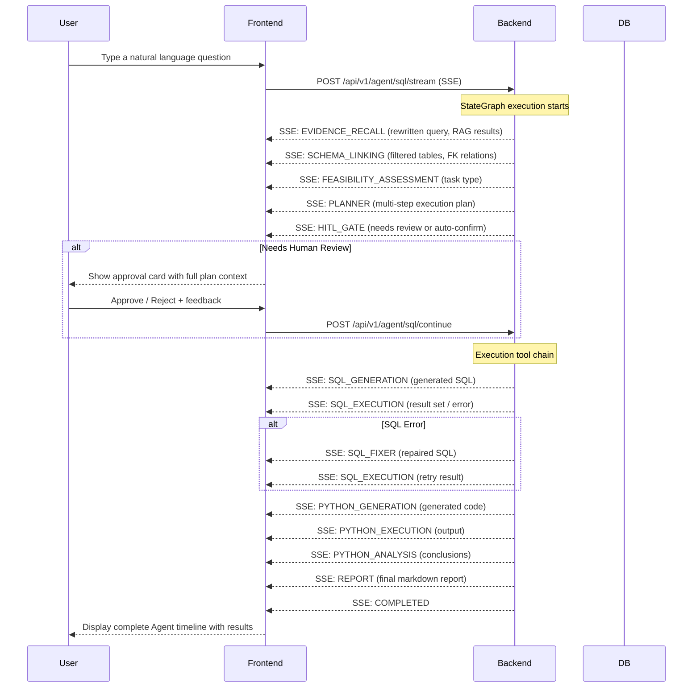

# 📊 Must Be The SQL (Updating)

<p align="center">
  
  
  
  
  
  
</p>

<p align="center">
  <b>💻 AI-powered database workspace — Agent timeline, multi-tab SQL editor, and schema browser</b>
</p>

<p align="center">
  <a href="./README.zh-CN.md">🇨🇳 中文文档</a> |
  <a href="#quick-start">⚡ Quick Start</a> |
  <a href="https://github.com/shixia9/MustBeTheSQL-Server">Server</a>
</p>

---

## 📖 Overview

**SQL Logic Engine Frontend** is a modern single-page application built with React 19, TypeScript, and Vite. It provides an intuitive interface for database exploration and management, and a **real-time AI Agent terminal** that visualizes the SQL Agent's multi-step reasoning process as it retrieves knowledge, analyzes schemas, plans execution, and generates SQL results.

---

## 🧠 AI Agent Timeline

The centerpiece of the application is the **Agent Flow Panel** — a terminal/CLI-style real-time timeline that displays each node of the backend StateGraph as it executes.



### Agent Timeline Features

| Feature | Description |
|---------|-------------|
| **Real-time Streaming** | Each node's completion event appears as a timeline card the moment it arrives |
| **Step-by-Step Visualization** | 14 node types with distinct icons and labels |
| **Human-in-the-Loop UI** | Approval card displays the full execution plan; users can approve, reject, or provide feedback |
| **Auto-confirm Toggle** | Slide a switch to skip the review gate (plans execute automatically) |
| **SQL Result Table** | Rendered results with pagination and chart toggle (bar chart for numeric data) |
| **Python Code Display** | Collapsible code blocks with syntax highlighting |
| **Execution Timing** | Each step shows its duration (ms) |
| **Error Highlighting** | Failed steps are clearly marked in red with error messages |
| **Knowledge Recall Card** | Collapsible card showing RAG-retrieved glossary terms and few-shot Q/A pairs with relevance scores |

---

## 🖥️ User Interface

### Pages

| Page | Route | Purpose |
|------|-------|---------|
| **Dashboard** | `/dashboard` | **SQL Agent Terminal** — the primary interface for natural-language-to-SQL with the Agent execution timeline |
| **Workspace** | `/workspace` | **Database Browser + Multi-Tab SQL Editor** — explore schemas, write and execute SQL directly |
| **History** | `/history` | Query history log |
| **Database** | `/database` | Manage database connections |
| **Settings** | `/settings` | LLM configuration, account settings |
| **Profile** | `/profile` | User profile |

### Dashboard — Agent Terminal

The main page displays:
- A **top bar** with database connection selector (with live indicator), LLM config selector, and auto-confirm toggle
- A **terminal-style output area** showing the Agent execution timeline with per-node result cards
- A **command input** at the bottom where users type their natural language queries

Each Agent node card shows:
- A status icon (`✓` success, `◉` running, `✗` error, `○` pending)
- The node name with a unique emoji icon
- Execution duration for completed steps
- Node-specific content (SQL code blocks, execution results, analysis text, etc.)

### Workspace — Database Explorer

- **Sidebar**: Tree navigation for schemas, tables, columns, and indexes
- **Editor area**: Multi-tab SQL console with Monaco Editor
- SQL syntax highlighting via `sql-formatter`
- Table data preview with inline editing support

---

## 🏗️ Project Structure

```
src/
├── api/                    # HTTP client (fetch-based)
│   └── client.ts
├── components/
│   ├── agent/              # Agent Flow Panel and result cards
│   │   ├── AgentFlowPanel.tsx       # Main Agent timeline component
│   │   └── cards/
│   │       ├── EvidenceRecallCard.tsx  # RAG knowledge recall display
│   │       ├── SqlCodeBlock.tsx        # Syntax-highlighted SQL/code
│   │       ├── ThinkingSection.tsx     # Collapsible detail section
│   │       └── ResultChart.tsx         # Bar chart visualization
│   ├── editor/
│   │   └── SqlEditor.tsx             # Monaco-based SQL editor
│   ├── workspace/
│   │   ├── WorkspaceTree.tsx         # Schema tree navigator
│   │   ├── WorkspaceEditor.tsx       # Multi-tab editor container
│   │   ├── SqlConsole.tsx            # SQL execution console
│   │   └── TableCell.tsx             # Table cell renderer
│   ├── Sidebar.tsx          # Left navigation sidebar
│   ├── TopNav.tsx           # Top navigation bar
│   └── ErrorBoundary.tsx    # Error boundary
├── contexts/
│   ├── SettingsContext.tsx   # App-wide settings context
│   └── LlmConfigContext.tsx  # LLM configuration context
├── pages/
│   ├── DashboardPage.tsx    # Agent terminal page
│   ├── WorkspacePage.tsx    # Database workspace page
│   ├── HistoryPage.tsx      # Query history
│   ├── DatabasePage.tsx     # Connection management
│   ├── SettingsPage.tsx     # Application settings
│   ├── ProfilePage.tsx      # User profile
│   └── LoginPage.tsx        # Authentication
├── stores/
│   └── workspaceStore.ts    # Zustand workspace store
├── types/
│   ├── agent.ts             # Agent timeline types
│   └── types.ts             # Shared types
├── utils/
│   ├── memoryUtils.ts       # In-memory cache
│   └── storageUtils.ts      # LocalStorage helpers
├── App.tsx                  # Root component with routing
├── main.tsx                 # Entry point
└── constants.ts             # App constants
```

---

## ✨ Key Technologies

| Technology | Purpose |
|-----------|---------|
| **React 19** | UI framework |
| **TypeScript 5.8** | Type-safe JavaScript |
| **Vite 6** | Dev server & build tool |
| **Tailwind CSS 4.1** | Utility-first styling |
| **Zustand 5** | Lightweight state management |
| **Monaco Editor** (`@monaco-editor/react`) | SQL code editor |
| **react-markdown** + **remark-gfm** | Markdown rendering for Agent reports |
| **lucide-react** | Icon library |
| **recharts** | Data visualization (result charts) |
| **shiki** | Code syntax highlighting |

---

## 🚀 Quick Start

### Prerequisites

- Node.js 18+
- pnpm / npm / yarn
- Backend service running (see [backend README](https://github.com/shixia9/MustBeTheSQL-Server))

### 1. Clone and install

```bash
git clone https://github.com/shixia9/MustBeTheSQL.git
cd MustBeTheSQL
npm install
```

### 2. Configure environment

Copy `.env.example` to `.env` and set your backend API base URL:

```env
VITE_API_BASE_URL=http://localhost:8080
```

### 3. Start development server

```bash
npm run dev
```

The app opens at `http://localhost:3000`.

### 4. Production build

```bash
npm run build
npm run preview
```

---

## 🔗 Integration Points

The frontend communicates with the backend via:

| Channel | Protocol | Endpoints |
|---------|----------|-----------|
| **Agent SSE Stream** | Server-Sent Events | `POST /api/v1/agent/sql/stream` |
| **Agent Resume** | SSE | `POST /api/v1/agent/sql/continue` |
| **REST APIs** | JSON over HTTP | `/api/v1/database/*`, `/api/v1/workspace/*`, etc. |

---

## 🧪 Project Status

- ✅ **Phase 1**: Single LLM call NL2SQL
- ✅ **Phase 2**: Schema Linking — FK expansion + LLM table filtering + data sampling
- ✅ **Phase 3**: Feasibility Assessment + Planner + Plan Dispatch with SQL/Python tool loops
- ✅ **Phase 4**: Human-in-the-Loop (HITL) — interrupt/resume via StateGraph checkpoints
- ✅ **Phase 5**: RAG Knowledge — pgvector two-channel retrieval (glossary + few-shot Q/A)
- 🚧 **Future**: Semantic model integration, multi-turn conversation memory, advanced Python analysis
