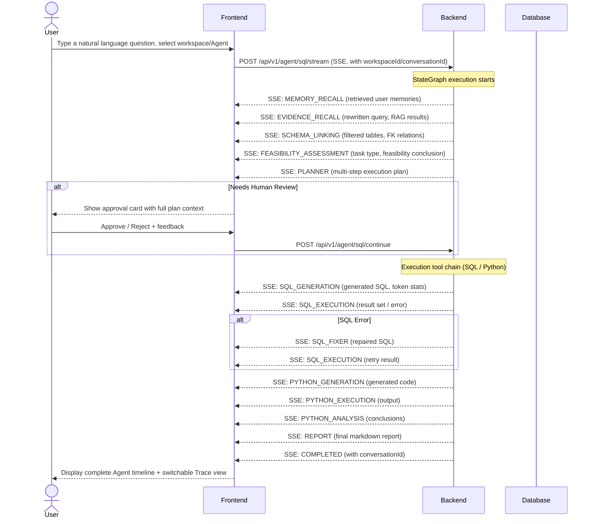

# 📊 Must Be The SQL

<p align="center">
  
  
  
  
  
  
</p>

<p align="center">
  <b>NL2SQL Agent backend — StateGraph reasoning engine + LLM high availability + MCP tool ecosystem + Multi-tenant workspaces</b>
</p>

<p align="center">
  <a href="./README.zh-CN.md">🇨🇳 中文文档</a> |
  <a href="#quick-start">⚡ Quick Start</a> |
  <a href="https://github.com/shixia9/MustBeTheSQL-Server">Server</a>
</p>

---

## 📖 Overview

**SQL Logic Engine Frontend** is a modern application built with React 19, TypeScript, and Vite. It provides an intuitive interface for database exploration and management, and a **real-time AI Agent terminal** that visualizes the SQL Agent's multi-step reasoning process — from memory retrieval and knowledge recall through schema analysis, execution planning, and SQL generation to the final report.

### Core Experiences

| Module | Description |
|--------|-------------|
| **Agent Terminal** | Natural language input, SSE real-time streaming of 18-node execution timeline |
| **Multi-Turn Conversations** | Context accumulates automatically; supports follow-up questions and "Continue" from history |
| **Agent Studio** | Visual Agent configuration (prompts/tool toggles/RAG/memory/context strategy/versioning) |
| **Workspace Management** | Create/join workspaces, member invitations & role management, workspace-level resource isolation |
| **SQL Console** | Multi-tab Monaco editor + Schema tree browser + DDL generation |
| **LLM Configuration** | Multi-provider management + HA strategy panel (strategy selector/fallback chain/health metrics) |
| **Memory Management** | Visual memory list (type filter/manual add/delete) |
| **MCP Tool Ecosystem** | 4 BUILTIN tools + MCP protocol (SSE/Stdio) for external tool integration, unified toggle via Agent Studio |
| **Admin Dashboard** | Standalone Admin SPA (user management/LLM monitoring/usage statistics) |

---

## 🧠 AI Agent Timeline

The centerpiece of the application is the **Agent Flow Panel** — a terminal/CLI-style real-time timeline that displays each node of the backend StateGraph as it executes.



### Agent Timeline Features

| Feature | Description |
|---------|-------------|
| **Real-time Streaming** | Each node's completion event appears as a timeline card the moment it arrives |
| **Message Type Classification** | 5 message types (THINKING/TOOL_CALL/TOOL_RESULT/REPORT/STATUS) with distinct colors and animations |
| **Step-by-Step Visualization** | 18 node types with distinct icons, category colors (planning blue/execution green/gate amber/report accent), and labels |
| **Human-in-the-Loop UI** | Approval card displays full execution plan with collapsible sections; users can approve, reject, or provide feedback |
| **Auto-confirm Toggle** | Slide a switch to skip the review gate (plans execute automatically) |
| **Trace View** | Toggle between "Timeline" and "Trace" — token statistics + waterfall bar chart + per-step latency |
| **Feasibility Card** | Color-coded conclusion with semantic icons (✓ achievable / ⚠ needs clarification / 💬 casual chat) |
| **Running Animation** | Pulsing text + spinning loader icon for in-progress nodes |
| **SQL Result Table** | Rendered results with pagination and chart toggle (bar chart for numeric data) |
| **Python Code Display** | Collapsible code blocks with syntax highlighting (shiki) |
| **Execution Timing** | Each step shows formatted duration (e.g. `1.2s`) |
| **Error Highlighting** | Failed steps clearly marked in red with detailed error messages |
| **Knowledge Recall Card** | Collapsible card showing RAG-retrieved glossary terms and few-shot Q/A pairs with relevance scores |
| **Multi-Turn Conversations** | "New" button resets session; COMPLETED event provides conversationId for continuous dialogue |

---

## 🖥️ User Interface

### Pages

| Page | Route | Purpose |
|------|-------|---------|
| **Dashboard** | `/dashboard` | **Agent Terminal** — the primary interface for natural-language-to-SQL with Agent execution timeline |
| **Schema Browser** | `/schema-browser` | **Database Browser + Multi-Tab SQL Editor** — explore schemas, write and execute SQL directly |
| **History** | `/history` | Query history + **conversation list** (grouped by conversation, with "Continue" to resume) |
| **Agent Studio** | `/agent-studio` | **Agent Editor** — 5-section configuration (basics/prompts/tools/RAG/memory) + version management |
| **MCP Servers** | `/mcp-servers` | MCP server management (add/connect/disconnect, supports SSE and Stdio transports) |
| **Workspace Manage** | `/workspace-manage` | Workspace management — member invitations, role changes, workspace settings |
| **Database** | `/database` | Manage database connections |
| **Settings** | `/settings` | LLM configuration + **HA strategy panel** + **memory management panel** |
| **Profile** | `/profile` | User profile |
| **Login** | `/login` | Authentication + GitHub OAuth SSO button |

### Dashboard — Agent Terminal

The main page displays:
- **Top bar**: database connection selector (with live indicator), LLM config selector, and auto-confirm toggle
- **Workspace selector**: sidebar top allows switching workspaces for resource isolation
- **Terminal-style output area**: Agent execution timeline with category-colored result cards
- **Trace/Timeline toggle**: switch between timeline view and Trace performance view
- **Command input** at the bottom: where users type natural language queries

Each Agent node card shows:
- Status icon (`✓` success, `◉` running, `✗` error, `○` pending)
- Color-coded left border by category (planning/execution/gate/report)
- Node name with emoji icon + message type badge
- Formatted execution duration
- Node-specific content (SQL code blocks, execution results, analysis text, etc.)

### Agent Studio — Agent Editor

5-section configuration interface:
1. **Basics**: avatar, name, description
2. **Prompt Config**: system prompt + welcome message
3. **Tool Config**: 4 tool toggle cards (SQL/Schema/Python/Data Sample); MCP external tools appear here automatically after server registration
4. **RAG Config**: enable toggle + Top-K + score threshold + **context strategy** (TRUNCATE/SUMMARIZE)
5. **Memory**: injection toggle

Bottom actions: Save / Set Default / Delete / **Publish Version** (snapshot)

### Schema Browser — Database Explorer

- **Sidebar**: Tree navigation for schemas, tables, columns, and indexes
- **Editor area**: Multi-tab SQL console with Monaco Editor
- SQL syntax highlighting via `sql-formatter`
- Table data preview with inline editor support
- DDL auto-generation and export

### Settings — LLM HA & Memory

- **LLM config cards**: provider/model/base URL/API key management + test connection button + health status dot
- **HA strategy panel** (expandable per card): circuit status/success rate/latency metrics + strategy selector + fallback chain multi-select
- **Memory management panel**: type filter (PROFILE/TASK/FACT/EPISODIC) + manual add form + memory list (with importance/time/delete)

### History — Queries & Conversations

- **Queries tab**: flat Agent execution record list, filterable by workspace
- **Conversations tab**: conversation card list (title/turn count/last message/time), "Continue" button to resume a historical conversation

### Admin Dashboard (Admin SPA, Port 3001)

- **Overview**: stat cards + recharts bar chart (LLM call volume by Config)
- **Users**: search + paginated table (username/email/status/quota/admin flag), actions: enable/disable, adjust quota
- **LLM Monitor**: per-config call volume/success rate (progress bar)/failure count/avg latency/token consumption table

---

## 🏗️ Project Structure

```
src/
├── api/
│   └── client.ts                      # HTTP client (fetch-based, covers all APIs)
├── components/
│   ├── agent/
│   │   ├── AgentFlowPanel.tsx         # Main Agent timeline (SSE streaming + conversationId + Trace toggle)
│   │   └── cards/
│   │       ├── EvidenceRecallCard.tsx # RAG knowledge recall display
│   │       ├── FeasibilityCard.tsx    # Feasibility assessment card (semantic coloring)
│   │       ├── SqlCodeBlock.tsx       # Syntax-highlighted SQL/code
│   │       ├── ThinkingSection.tsx    # Collapsible detail section (with running animation)
│   │       ├── TraceCard.tsx          # Trace performance view (stats header + waterfall chart)
│   │       └── ResultChart.tsx        # Bar chart visualization
│   ├── editor/
│   │   └── SqlEditor.tsx             # Monaco-based SQL editor
│   ├── workspace/
│   │   ├── WorkspaceTree.tsx         # Schema tree navigator
│   │   ├── WorkspaceEditor.tsx       # Multi-tab editor container
│   │   ├── WorkspaceSelector.tsx     # Workspace selector
│   │   ├── SqlConsole.tsx            # SQL execution console
│   │   └── TableCell.tsx             # Table cell renderer
│   ├── LlmStrategyPanel.tsx          # LLM HA strategy panel (metrics + strategy + fallback chain)
│   ├── MemoryPanel.tsx               # Memory management panel (filter/add/delete)
│   ├── Sidebar.tsx                   # Left navigation (with workspace selector, Admin entry)
│   ├── TopNav.tsx                    # Top navigation bar
│   ├── ConfirmDialog.tsx             # Confirm dialog
│   └── ErrorBoundary.tsx             # Error boundary
├── contexts/
│   ├── SettingsContext.tsx            # App-wide settings context
│   └── LlmConfigContext.tsx           # LLM configuration context
├── pages/
│   ├── DashboardPage.tsx             # Agent terminal page (with initialConversationId)
│   ├── AgentStudioPage.tsx           # Agent editor (5-section + context strategy + version entry)
│   ├── SchemaBrowserPage.tsx         # Schema browser (renamed from WorkspacePage)
│   ├── HistoryPage.tsx               # Query history + conversation tabs (Continue button)
│   ├── WorkspaceManagePage.tsx       # Workspace management (members/roles)
│   ├── McpServerPage.tsx             # MCP server management (Phase E in progress)
│   ├── DatabasePage.tsx              # Connection management
│   ├── SettingsPage.tsx              # LLM config + HA strategy + memory management
│   ├── ProfilePage.tsx               # User profile
│   ├── LoginPage.tsx                 # Auth + GitHub OAuth button
│   └── JoinWorkspacePage.tsx         # Join workspace
├── stores/
│   └── workspaceStore.ts             # Zustand workspace state
├── types/
│   ├── agent.ts                      # Agent timeline types (MessageType/category/colors/Trace)
│   └── types.ts                      # Shared types (Page/admin/Agent/LlmConfig etc.)
├── utils/
│   ├── memoryUtils.ts                # In-memory cache
│   └── storageUtils.ts               # LocalStorage helpers
├── i18n/
│   ├── index.ts                      # i18n entry
│   └── locales/
│       ├── en.json                   # English translations
│       └── zh.json                   # Chinese translations
├── App.tsx                           # Root component (routing + navigate events + Admin redirect)
├── main.tsx                          # Entry point
└── constants.ts                      # App constants
```

### Standalone Admin Frontend (`sql-logic-admin/`)

```
sql-logic-admin/src/
├── api/
│   └── client.ts                     # Admin HTTP client
├── pages/
│   └── Dashboard.tsx                 # Admin Dashboard (Overview/Users/LLM Monitor tabs)
├── App.tsx                           # Admin root component
├── main.tsx                          # Admin entry
└── index.css                         # Styles
```

---

## ✨ Key Technologies

| Technology | Purpose |
|-----------|---------|
| **React 19** | UI framework |
| **TypeScript 5.8** | Type-safe JavaScript |
| **Vite 6** | Dev server & build tool |
| **Tailwind CSS 4.1** | Utility-first styling |
| **Zustand 5** | Lightweight state management |
| **Monaco Editor** (`@monaco-editor/react`) | SQL code editor |
| **react-markdown** + **remark-gfm** | Markdown rendering for Agent reports |
| **lucide-react** | Icon library |
| **recharts** | Data visualization (result charts, admin dashboard charts) |
| **shiki** | Code syntax highlighting |

---

## 🚀 Quick Start

### Prerequisites

- Node.js 18+
- pnpm / npm / yarn
- Backend service running (see [backend README](https://github.com/shixia9/MustBeTheSQL-Server))

### 1. Clone and install

```bash
git clone https://github.com/shixia9/MustBeTheSQL.git
cd MustBeTheSQL
npm install
```

### 2. Configure environment

Copy `.env.example` to `.env` and set your backend API base URL and admin URL:

```env
VITE_API_BASE_URL=http://localhost:8080
VITE_ADMIN_URL=http://localhost:3001
```

### 3. Start development server

```bash
# Main client
npm run dev
# → http://localhost:3000

# Admin dashboard (optional)
cd ../sql-logic-admin
npm run dev
# → http://localhost:3001
```

### 4. Production build

```bash
npm run build
npm run preview
```

---

## 🔗 Integration Points

The frontend communicates with the backend via:

| Channel | Protocol | Endpoints |
|---------|----------|-----------|
| **Agent SSE Stream** | Server-Sent Events | `POST /api/v1/agent/sql/stream` |
| **Agent Resume** | SSE | `POST /api/v1/agent/sql/continue` |
| **REST APIs** | JSON over HTTP | `/api/v1/*` |
| **Admin Redirect** | New Tab | `VITE_ADMIN_URL` → Admin standalone SPA |

### Request Context

- **workspaceId**: carried in Agent requests and history queries for workspace-level isolation
- **conversationId**: null on first turn, backfilled by COMPLETED event, subsequent queries carry the same ID for multi-turn conversations
- **agentId**: custom Agent ID from Agent Studio, transmitted to backend for `AgentRuntimeConfigService` to load configuration

---

## 🧪 Project Phases

### Completed

- ✅ **Phase 1-5**: NL2SQL → Schema Linking → Plan Dispatch → HITL → RAG Knowledge
- ✅ **Phase A**: Message type classification & category coloring + Workspace selector + Trace view + LLM test connection UI
- ✅ **Phase B**: Agent Studio 5-section editor + LLM HA strategy panel + Memory management panel + Conversation context UI
- ✅ **Phase C**: Sidebar History/Admin navigation + Conversation tabs & Continue + Tool toggle UI closure
- ✅ **Phase D**: GitHub OAuth login button + Admin entry + contextStrategy UI + Workspace ownership fields
- 🚧 **Phase E**: MCP server management page + Agent version management UI + Dynamic tool loading + Workspace ownership visualization
