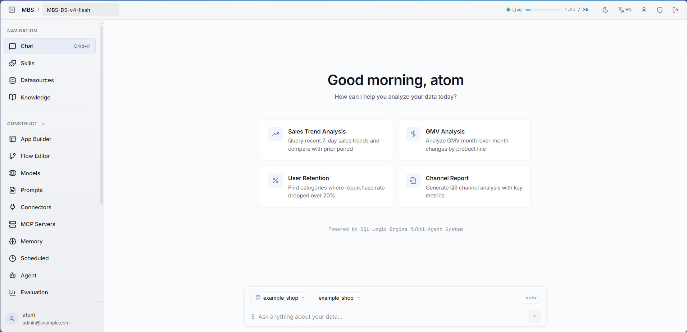
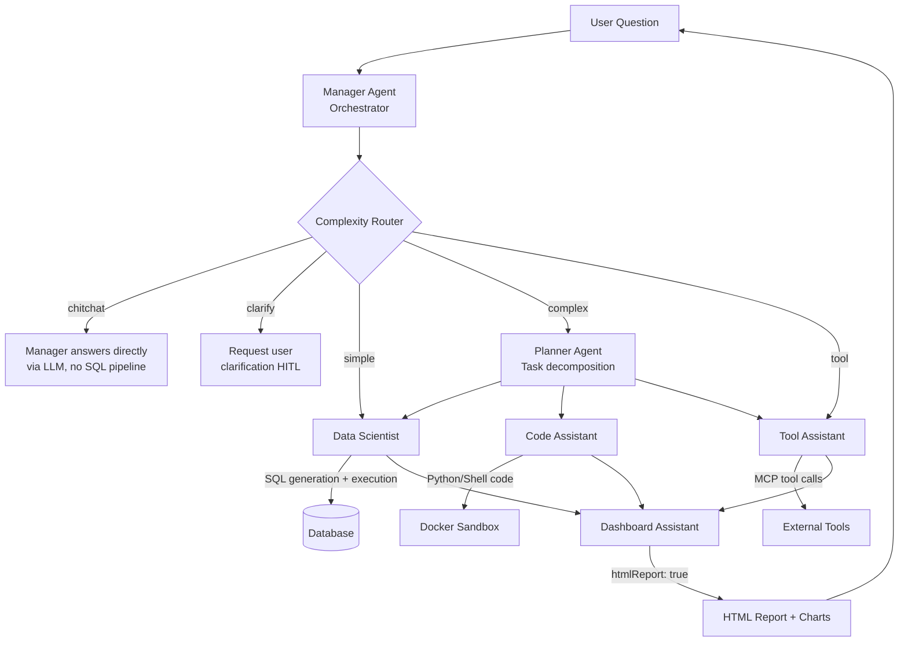
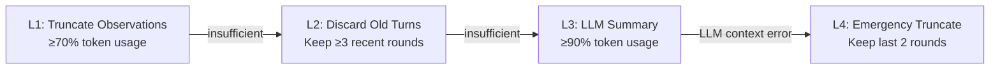
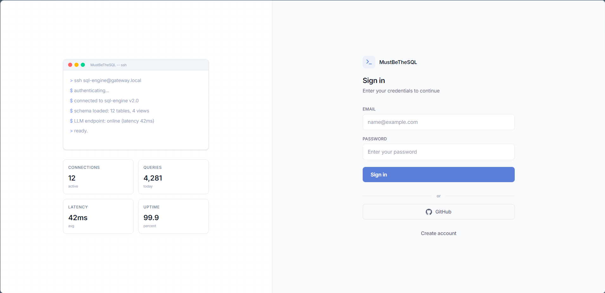
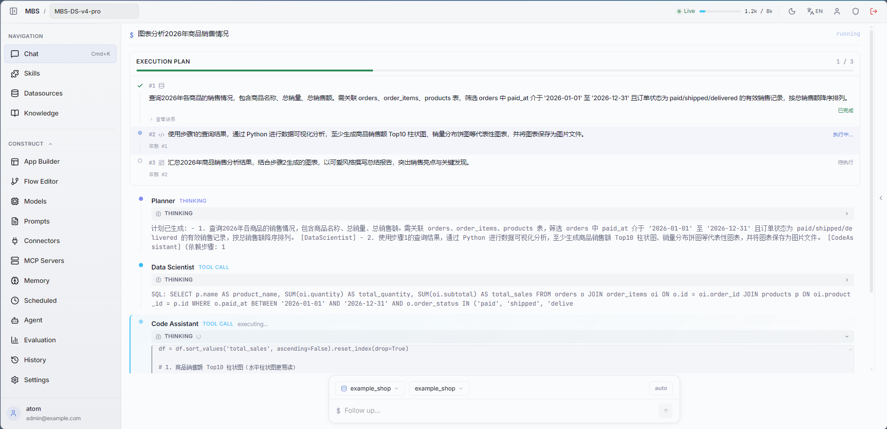
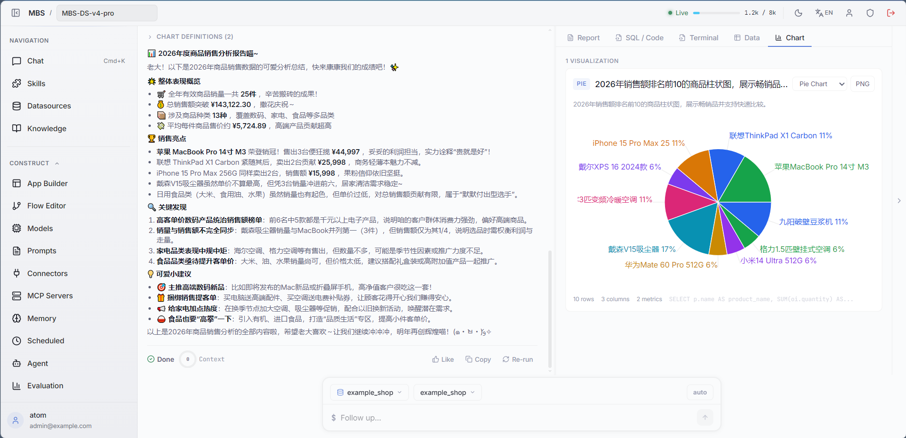
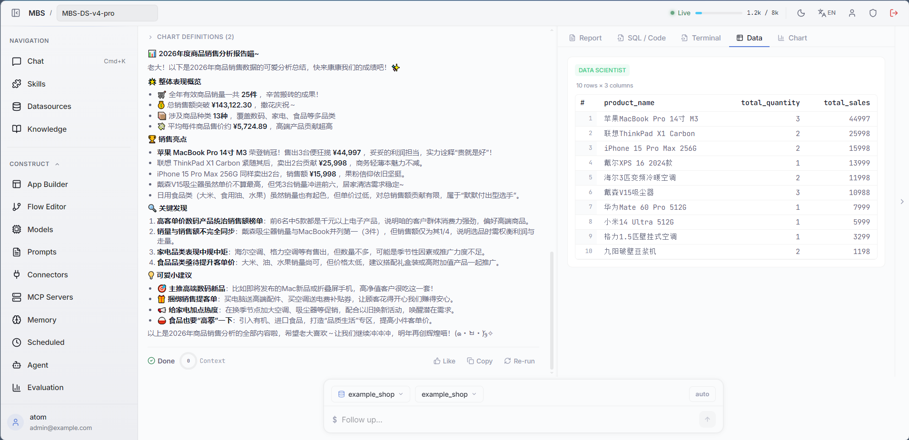
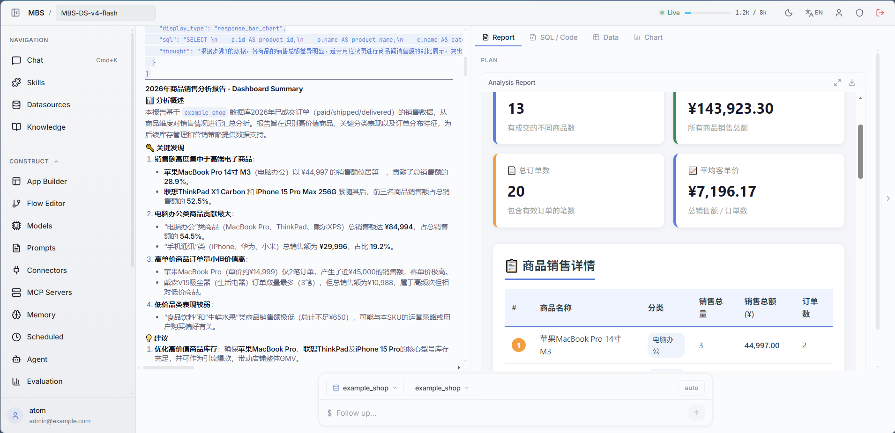
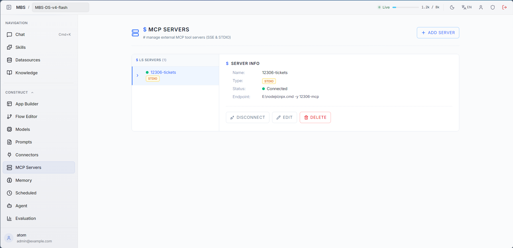
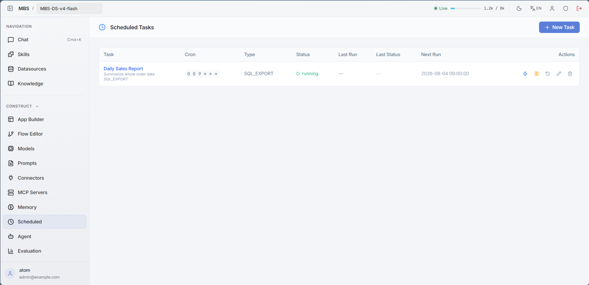

# Must Be The SQL

<p align="center">
  
  
  
  
  
  
</p>

<p align="center">
  <b>Multi-Agent NL2SQL platform — Autonomous data analysis with LLM thinking, context compression & sandboxed execution</b>
</p>

<p align="center">
  <a href="https://github.com/shixia9/MustBeTheSQL-Server">Backend</a> |
  <a href="#quick-start">Quick Start</a> |
  <a href="#architecture">Architecture</a>
</p>

---

<!-- 主页截图 -->
<p align="center">
  
</p>

---

## What is Must Be The SQL?

Must Be The SQL is an AI data assistant that connects to your databases, understands natural-language questions, and autonomously performs data analysis end-to-end.

Users describe their data needs in plain language. A team of specialised AI agents — each with its own LLM thinking process — collaborates to explore the database schema, plan multi-step execution, generate and fix SQL, run Python analysis in a sandbox, and deliver a consolidated report.

### Key Capabilities

- **Multi-Agent collaboration** — A Manager agent orchestrates specialist agents (Data Scientist, Code Assistant, Tool Assistant, Dashboard Assistant), each with autonomous decision-making
- **Progressive context compression** — Four-layer strategy (L1–L4) keeps conversations within token budgets without losing critical context
- **Sandboxed code execution** — Python/Shell scripts run in Docker-isolated sandboxes with security validation
- **Multi-turn conversations** — Context accumulates across turns with automatic summarisation and memory injection
- **MCP tool ecosystem** — Built-in tools plus Model Context Protocol support for external tool integration
- **Human-in-the-Loop** — Optional plan approval gate before execution, with auto-confirm mode
- **Multi-tenant workspaces** — User → Workspace isolation with 4-tier roles
- **LLM high availability** — Load balancing, circuit breaker, fallback chain, session affinity

---

## Architecture

### Multi-Agent System

The platform uses a multi-agent architecture where a **Manager** agent receives user requests and dispatches tasks to specialised worker agents. Each agent has its own LLM strategy, memory, and action set.



### Agent Roles

| Agent | Role | Capabilities |
|-------|------|-------------|
| **Manager** | Orchestrator | Receives user request, routes by complexity, coordinates worker agents, aggregates results |
| **Planner** | Task Planner | Decomposes complex requests into structured execution plans with step-by-step assignment |
| **Data Scientist** | SQL Expert | Multi-candidate SQL generation, execution, auto-repair, chart visualisation |
| **Code Assistant** | Code Engineer | Python/Shell code generation, sandbox execution, data analysis |
| **Tool Assistant** | Tool Specialist | MCP external tool discovery and invocation |
| **Dashboard Assistant** | Report Generator | Synthesises execution results into HTML reports, dashboards, and summaries |

### Routing Paths

The Manager Agent classifies each request and routes it through one of five paths:

| Path | Trigger | Behaviour |
|------|---------|-----------|
| **Tool Invocation** | User picked a tool from the `/` command palette | Routes directly to Tool Assistant, skips complexity assessment |
| **Chitchat** | Greetings, general-knowledge, capability questions | Manager answers directly via LLM — no SQL pipeline, no report |
| **Clarify** | Question is ambiguous or missing critical info | Requests user clarification (HITL gate when enabled) |
| **Simple** | A single SQL can answer | Direct to Data Scientist (skip Planner), then text summary (no HTML report) |
| **Complex** | Report/chart/multi-step analysis needed | Planner → Workers → Dashboard full pipeline (HTML report) |

### Inter-Agent Communication

Agents communicate through a pluggable message bus with three modes (controlled by `bus-orc.mode`):

| Mode | Behaviour | Use Case |
|------|-----------|----------|
| `OFF` (default) | Direct method calls | Production |
| `SWITCH` | Bus-mediated request/reply | Full bus orchestration |

### Context Compression

A four-layer progressive strategy keeps conversations within token budgets:



### Sandbox Execution

The sandbox module follows a four-layer architecture for secure code execution:

| Layer | Responsibility |
|-------|---------------|
| **Execution Layer** | `SandboxRuntime` (Docker/Local) — isolated code execution |
| **Control Layer** | `SandboxControlService` — per-session locks, lifecycle management |
| **User Layer** | `SandboxController` — REST API for code submission |
| **Display Layer** | `DisplayResult` — formatted output for frontend rendering |

Security defaults are **fail-closed**: Docker is preferred; Local runtime is dev/test only.

---

## Project Structure

```
MustBeTheSQL/
├── sql-logic-client/           # Main client application
│   ├── src/
│   │   ├── pages/              #   Route pages (Chat, Schema, History, Agent Studio, ...)
│   │   ├── components/
│   │   │   ├── agent/          #   Agent execution UI (StepTimeline, ThinkingPanel, OutputPanel, ...)
│   │   │   ├── chart/         #   Chart visualizations
│   │   │   ├── editor/        #   Monaco SQL editor
│   │   │   ├── layout/        #   App layout, sidebar, top nav
│   │   │   ├── ui/            #   Shared UI components
│   │   │   └── workflow/      #   Workflow editor nodes
│   │   ├── stores/            #   Zustand stores (conversation, workspace, command palette)
│   │   ├── contexts/          #   React contexts (Auth, LLMConfig, Settings, Layout)
│   │   ├── api/               #   HTTP client
│   │   ├── i18n/              #   Internationalization (en, zh)
│   │   └── utils/             #   Utilities (vis parser, chart analyzer, export)
│   ├── vite.config.ts         #   Vite config (proxy, docs integration)
│   └── package.json
│
├── sql-logic-admin/           # Admin dashboard
│   ├── src/
│   │   ├── pages/Dashboard.tsx #   Overview, Users, LLM Monitor
│   │   └── App.tsx
│   └── package.json
│
└── sql-logic-docs/            # Documentation site
    ├── docs/
    │   └── guide/             #   Agent execution, workflow design, admin dashboard
    └── docusaurus.config.ts
```

### Pages

| Page | Route | Purpose |
|------|-------|---------|
| **Chat** | `/chat` | Multi-agent conversation interface with timeline, thinking, and report |
| **Schema Browser** | `/schema-browser` | Database explorer + multi-tab SQL console |
| **History** | `/history` | Query history + conversation list (with "Continue" to resume) |
| **Agent Studio** | `/agent-studio` | Agent configuration (prompt/tools/RAG/memory) |
| **Flow Editor** | `/flow-editor` | Visual workflow editor |
| **MCP Servers** | `/mcp-servers` | MCP server management (SSE/Stdio) |
| **Database** | `/database` | Database connection management |
| **Settings** | `/settings` | LLM config + HA strategy + memory management |
| **Workspace** | `/workspace-manage` | Workspace & member management |
| **Knowledge** | `/knowledge` | Knowledge base management |
| **Skills** | `/skills` | Skill management |
| **Login** | `/login` | Authentication + GitHub OAuth |

---

## Platform Features

### Security
- Sa-Token session management (Redis-backed)
- GitHub OAuth SSO
- 5-layer SQL validation chain
- Optional rate limiting (30 req/min/user)

### LLM High Availability
- 4 load-balancing strategies: Round-Robin / Latency-First / Success-Rate-First / Smart weighted
- Circuit breaker: opens after 5 consecutive failures, 30s cooldown
- User-configurable fallback chain
- Session affinity for context stability
- Per-minute metrics aggregation (call volume, success rate, latency, token usage)

### Memory System
- Four memory types: PROFILE (preferences), TASK (patterns), FACT (business knowledge), EPISODIC (session context)
- pgvector-backed semantic search with SHA256 deduplication
- Automatic extraction from conversation transcripts
- Top-K relevance injection into agent prompts

### RAG Knowledge
- pgvector dual-channel retrieval: business glossary terms + few-shot Q/A pairs
- Configurable Top-K and score threshold per agent

### MCP Tool Ecosystem
- 4 built-in tools (SQL, Schema, Python, Data Sample)
- MCP protocol support: SSE transport (remote) and Stdio transport (local CLI)
- Dynamic tool discovery and registration
- Agent Studio tool toggles control runtime tool gating

### SQL Execution Safety
- Multi-layer validation: safety check → user status → token quota
- JSQLParser-based statement parsing
- SQL audit logging via AOP
- Automatic SQL repair (up to 2 retries)

---

## Quick Start

### Prerequisites

- Node.js 18+
- pnpm / npm / yarn
- Backend service running (see [Backend README](https://github.com/shixia9/MustBeTheSQL-Server))

### 1. Clone and install

```bash
git clone https://github.com/shixia9/MustBeTheSQL.git
cd MustBeTheSQL/sql-logic-client
npm install
```

### 2. Start development server

```bash
# Main client
npm run dev

# Admin dashboard (optional)
cd ../sql-logic-admin
npm install && npm run dev
```

### 4. Production build

```bash
npm run build
npm run preview
```

---

## Configuration

Key configuration files:

| File | Purpose |
|------|---------|
| `vite.config.ts` | Vite config (dev proxy, docs integration, build options) |
| `tailwind.config.ts` | Tailwind theme + CSS variables |
| `i18n/` | Internationalization resources (en, zh) |

### Environment Variables

| Variable | Default | Description |
|----------|---------|-------------|
| `VITE_API_BASE_URL` | `http://localhost:8080` | Backend API base URL |
| `VITE_ADMIN_URL` | `http://localhost:5144` | Admin dashboard URL |

### Integration Points

The frontend communicates with the backend via:

| Channel | Protocol | Purpose |
|---------|----------|---------|
| **Agent SSE Stream** | Server-Sent Events | Real-time agent execution, thinking, and sandbox output |
| **REST APIs** | JSON over HTTP | All non-streaming operations |
| **Admin Redirect** | New Tab | Link to standalone admin SPA |

### SSE Event Types

| Event | Description |
|-------|-------------|
| `STARTED` | Agent node started execution |
| `THINKING` | Streaming reasoning chunk (with `done` flag) |
| `FINISHED` | Agent node completed with output |
| `SANDBOX` | Sandbox code execution output (streaming) |
| `PLAN_UPDATED` | Execution plan snapshot update |
| `CONTEXT_COMPACT` | Context compression triggered (L1–L4) |
| `COMPLETED` | Full agent run completed |

---

## API Endpoints

### Multi-Agent

| Endpoint | Method | Purpose |
|----------|--------|---------|
| `/api/v1/agentic/chat/stream` | POST | Start a multi-agent run (SSE streaming) |
| `/api/v1/agentic/continue` | POST | Resume a paused HITL session (SSE) |
| `/api/v1/sandbox/run` | POST | Execute code in sandbox |

### SQL & Database

| Endpoint | Method | Purpose |
|----------|--------|---------|
| `/api/v1/sql/execute` | POST | Execute SQL on connected database |
| `/api/v1/sql/console/execute` | POST | SQL console execution |
| `/api/v1/database/**` | Various | Database connection CRUD + metadata |
| `/api/v1/schema/**` | Various | Schema browser (tables/columns/indexes/DDL) |

### Workspaces

| Endpoint | Method | Purpose |
|----------|--------|---------|
| `/api/v1/workspaces` | GET / POST | List / create workspaces |
| `/api/v1/workspaces/{id}/members` | GET / POST | Member management |

### Agent Studio

| Endpoint | Method | Purpose |
|----------|--------|---------|
| `/api/v1/agent-entity` | CRUD | Agent configuration management |
| `/api/v1/agent-entity/{id}/publish` | POST | Publish version snapshot |
| `/api/v1/agent-entity/{id}/versions/{vid}/revert` | POST | Rollback to version |

### LLM & Memory

| Endpoint | Method | Purpose |
|----------|--------|---------|
| `/api/v1/llm-config` | CRUD | LLM provider configuration |
| `/api/v1/llm-config/{id}/test` | POST | Test LLM connectivity |
| `/api/v1/llm-config/{id}/strategy` | PUT | HA strategy + fallback chain |
| `/api/v1/memory/**` | Various | Memory CRUD + extraction |

### MCP Tools

| Endpoint | Method | Purpose |
|----------|--------|---------|
| `/api/v1/mcp-servers` | GET / POST | List / add MCP servers |
| `/api/v1/mcp-servers/{id}/connect` | POST | Reconnect |
| `/api/v1/tools` | GET | List registered tools |

---

## Technology Stack

| Technology | Purpose |
|-----------|---------|
| React 19 | UI framework |
| TypeScript 5.8 | Type-safe development |
| Vite 6 | Dev server & build tool |
| Tailwind CSS 4 | Utility-first styling with CSS variables for theming |
| Zustand 5 | Lightweight state management (persisted to localStorage) |
| Monaco Editor | SQL code editor |
| react-markdown + remark-gfm | Markdown rendering for agent reports |
| lucide-react | Vector icon library |
| recharts | Data visualization charts |
| shiki | Code syntax highlighting |
| i18next | Internationalization (English / Chinese) |

---

## Appendix: Feature Screenshots

> The following sections are reserved for feature screenshots. Images will be added in future updates.

### 1. Login Page

<p align="center">
  
</p>

### 2. Multi-Agent Chat Interface

<p align="center">
  
  <em>Planner — execution plan & TODO list</em>
</p>

<p align="center">
  
  <em>Chart visualization</em>
</p>

<p align="center">
  
  <em>SQL execution & data results</em>
</p>

<p align="center">
  
  <em>Dashboard Agent HTML report</em>
</p>

### 3. Dynamic Tool Registration

<p align="center">
  
</p>

### 4. Scheduled Tasks

<p align="center">
  
</p>

### 5. Workflow Editor

### 6. Database Connection

### 7. Memory System

### 8. Admin Dashboard

### 9. Others
