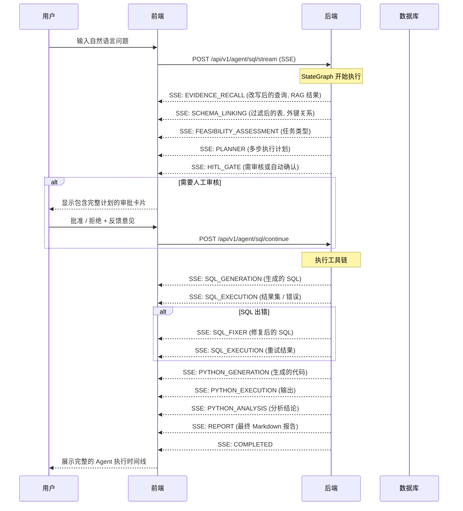

# 📊 Must Be The SQL

<p align="center">
  
  
  
  
  
  
</p>

<p align="center">
  <b>💻 AI 驱动的数据库工作台 — Agent 实时时间线、多标签 SQL 编辑器、Schema 浏览器</b>
</p>

<p align="center">
  <a href="./README.md">🇺🇸 English</a> |
  <a href="#快速开始">⚡ 快速开始</a> |
  <a href="https://github.com/shixia9/MustBeTheSQL-Server">服务端</a>
</p>

---

## 📖 项目简介

**SQL Logic Engine 前端** 是一个基于 React 19 + TypeScript + Vite 构建的现代化单页应用。它提供了直观的数据库探索和管理界面，以及一个**实时 AI Agent 终端**，可视化展示 SQL Agent 的多步推理过程——从知识检索、Schema 分析、执行计划、到最终 SQL 生成的全链路。

---

## 🧠 AI Agent 实时时间线

**Agent Flow Panel** 是应用的核心组件——一个终端/CLI 风格的实时时间线，逐节点展示后端 StateGraph 的执行过程。



### Agent 时间线特性

| 特性 | 说明 |
|------|------|
| **实时流式渲染** | 每个节点完成的瞬间即出现对应的时间线卡片 |
| **逐步骤可视化** | 14 种节点类型，各有独立图标和中文标签 |
| **人工介入（HITL）界面** | 审批卡片展示完整执行计划；用户可批准、拒绝或提供修改意见 |
| **自动确认开关** | 一键切换是否跳过审核门控（计划自动执行） |
| **SQL 结果表格** | 渲染查询结果，支持分页和图表切换（数值数据柱状图） |
| **Python 代码展示** | 可折叠的代码块，支持语法高亮 |
| **执行耗时** | 每个步骤显示执行耗时（毫秒） |
| **错误高亮** | 失败步骤红色标记，显示详细错误信息 |
| **知识召回卡片** | 可折叠卡片展示 RAG 检索到的术语表和 Few-Shot 问答对及关联度分数 |

---

## 🖥️ 用户界面

### 页面

| 页面 | 路由 | 用途 |
|------|------|------|
| **Dashboard** | `/dashboard` | **SQL Agent 终端** — 自然语言转 SQL 的主界面，展示 Agent 执行时间线 |
| **Workspace** | `/workspace` | **数据库浏览器 + 多标签 SQL 编辑器** — 探索 Schema、直接编写和执行 SQL |
| **History** | `/history` | 查询历史记录 |
| **Database** | `/database` | 管理数据库连接 |
| **Settings** | `/settings` | LLM 配置、应用设置 |
| **Profile** | `/profile` | 用户个人信息 |

### Dashboard — Agent 终端

主页展示如下内容：
- **顶部栏**：数据库连接选择器（含在线指示灯）、LLM 配置选择器、自动确认开关
- **终端风格输出区**：展示 Agent 执行时间线，每个节点一个结果卡片
- **底部的命令输入框**：用户在此输入自然语言查询

每个 Agent 节点卡片包含：
- 状态图标（`✓` 成功、`◉` 运行中、`✗` 失败、`○` 等待）
- 带 Emoji 图标的节点名称
- 已完成步骤的执行耗时
- 节点特定内容（SQL 代码块、执行结果、分析文本等）

### Workspace — 数据库工作台

- **左侧面板**：Schema、表、列、索引的树形导航
- **编辑区**：基于 Monaco Editor 的多标签 SQL 控制台
- SQL 语法高亮（通过 `sql-formatter`）
- 表数据预览，支持嵌入编辑器
- DDL 自动生成与导出

---

## 🏗️ 项目结构

```
src/
├── api/                    # HTTP 客户端（基于 fetch）
│   └── client.ts
├── components/
│   ├── agent/              # Agent 时间线面板及结果卡片
│   │   ├── AgentFlowPanel.tsx       # 主 Agent 时间线组件
│   │   └── cards/
│   │       ├── EvidenceRecallCard.tsx  # RAG 知识召回展示
│   │       ├── SqlCodeBlock.tsx        # 语法高亮 SQL/代码
│   │       ├── ThinkingSection.tsx     # 可折叠详情区块
│   │       └── ResultChart.tsx         # 柱状图可视化
│   ├── editor/
│   │   └── SqlEditor.tsx             # 基于 Monaco 的 SQL 编辑器
│   ├── workspace/
│   │   ├── WorkspaceTree.tsx         # Schema 树形导航
│   │   ├── WorkspaceEditor.tsx       # 多标签编辑器容器
│   │   ├── SqlConsole.tsx            # SQL 执行控制台
│   │   └── TableCell.tsx             # 表格单元渲染
│   ├── Sidebar.tsx          # 左侧导航菜单
│   ├── TopNav.tsx           # 顶部导航栏
│   └── ErrorBoundary.tsx    # 错误边界
├── contexts/
│   ├── SettingsContext.tsx   # 全局设置上下文
│   └── LlmConfigContext.tsx  # LLM 配置上下文
├── pages/
│   ├── DashboardPage.tsx    # Agent 终端主页
│   ├── WorkspacePage.tsx    # 数据库工作台
│   ├── HistoryPage.tsx      # 查询历史
│   ├── DatabasePage.tsx     # 连接管理
│   ├── SettingsPage.tsx     # 应用设置
│   ├── ProfilePage.tsx      # 个人信息
│   └── LoginPage.tsx        # 登录/注册
├── stores/
│   └── workspaceStore.ts    # Zustand 工作区状态管理
├── types/
│   ├── agent.ts             # Agent 时间线类型定义
│   └── types.ts             # 共享类型
├── utils/
│   ├── memoryUtils.ts       # 内存缓存
│   └── storageUtils.ts      # LocalStorage 工具
├── App.tsx                  # 根组件（路由）
├── main.tsx                 # 入口文件
└── constants.ts             # 应用常量
```

---

## ✨ 核心技术栈

| 技术 | 用途 |
|------|------|
| **React 19** | UI 框架 |
| **TypeScript 5.8** | 类型安全 |
| **Vite 6** | 开发服务器与构建工具 |
| **Tailwind CSS 4.1** | 原子化样式 |
| **Zustand 5** | 轻量状态管理 |
| **Monaco Editor** (`@monaco-editor/react`) | SQL 代码编辑器 |
| **react-markdown** + **remark-gfm** | 报告 Markdown 渲染 |
| **lucide-react** | 图标库 |
| **recharts** | 数据可视化（结果图表） |

---

## 🚀 快速开始

### 前置条件

- Node.js 18+
- pnpm / npm / yarn
- 后端服务已启动（参见[后端 README](https://github.com/shixia9/MustBeTheSQL-Server)）

### 1. 克隆并安装

```bash
git clone https://github.com/shixia9/MustBeTheSQL.git
cd MustBeTheSQL
npm install
```

### 2. 配置环境

复制 `.env.example` 为 `.env`，设置后端 API 地址：

```env
VITE_API_BASE_URL=http://localhost:8080
```

### 3. 启动开发服务器

```bash
npm run dev
```

浏览器打开 `http://localhost:3000` 即可访问。

### 4. 构建生产版本

```bash
npm run build
npm run preview
```

---

## 🔗 集成方式

前端通过以下方式与后端通信：

| 通道 | 协议 | 端点 |
|------|------|------|
| **Agent SSE 流** | Server-Sent Events | `POST /api/v1/agent/sql/stream` |
| **Agent 恢复** | SSE | `POST /api/v1/agent/sql/continue` |
| **REST API** | JSON over HTTP | `/api/v1/database/*`, `/api/v1/workspace/*` 等 |

---

## 🧪 项目阶段

- ✅ **Phase 1**：基础 NL2SQL 对话界面
- ✅ **Phase 2**：Agent 时间线 + 逐节点 SSE 流式渲染
- ✅ **Phase 3**：计划视图、SQL/Python 执行卡片、报告渲染
- ✅ **Phase 4**：HITL 审批卡片、自动确认开关、恢复执行流程
- ✅ **Phase 5**：知识召回卡片 + RAG 结果展示
