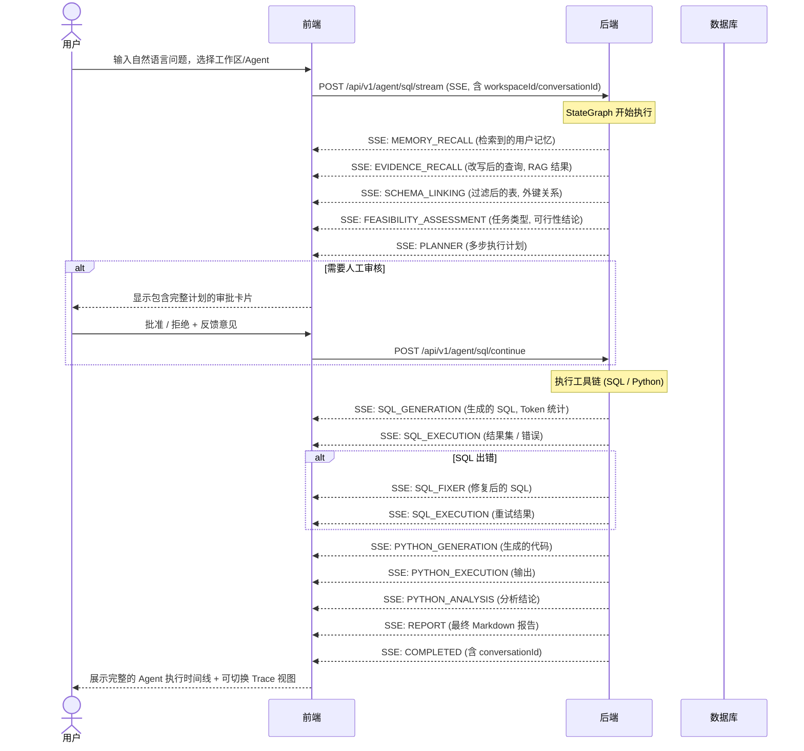

# 📊 Must Be The SQL

<p align="center">
  
  
  
  
  
  
</p>

<p align="center">
  <b>NL2SQL 智能 Agent 服务端 — StateGraph 多步推理引擎 + LLM 高可用 + MCP 工具生态 + 多租户工作区</b>
</p>

<p align="center">
  <a href="./README.md">🇺🇸 English</a> |
  <a href="#快速开始">⚡ 快速开始</a> |
  <a href="https://github.com/shixia9/MustBeTheSQL-Server">服务端</a>
</p>

---

## 📖 项目简介

**SQL Logic Engine 前端** 是一个基于 React 19 + TypeScript + Vite 构建的现代化应用。它提供了直观的数据库探索和管理界面，以及一个**实时 AI Agent 终端**，可视化展示 SQL Agent 的多步推理过程——从记忆检索、知识召回、Schema 分析、执行计划、SQL 生成到最终报告的全链路。

### 核心体验

| 功能模块 | 说明 |
|---------|------|
| **Agent 终端** | 自然语言输入，SSE 实时流式渲染 18 个节点的执行时间线 |
| **多轮追问** | 会话上下文自动累积，支持连续追问和 "Continue" 恢复历史会话 |
| **Agent Studio** | 可视化配置 Agent（提示词/工具开关/RAG/记忆/上下文策略/版本管理） |
| **工作区管理** | 创建/加入工作区，成员邀请与角色管理，工作区级资源隔离 |
| **SQL 控制台** | 多标签 Monaco 编辑器 + Schema 树形浏览器 + DDL 生成 |
| **LLM 配置** | 多 Provider 管理 + HA 策略面板（策略选择/降级链/健康指标） |
| **MCP 工具生态** | 内置 4 个 BUILTIN 工具 + MCP 协议 (SSE/Stdio) 外部工具接入，Agent Studio 统一开关 |
| **记忆管理** | 可视化记忆列表（类型筛选/手动添加/删除） |
| **管理后台** | 独立 Admin SPA（用户管理/LLM 监控/使用统计） |

---

## 🧠 AI Agent 实时时间线

**Agent Flow Panel** 是应用的核心组件——一个终端/CLI 风格的实时时间线，逐节点展示后端 StateGraph 的执行过程。



### Agent 时间线特性

| 特性 | 说明 |
|------|------|
| **实时流式渲染** | 每个节点完成的瞬间即出现对应的时间线卡片 |
| **消息类型区分** | 5 种消息类型（THINKING/TOOL_CALL/TOOL_RESULT/REPORT/STATUS），各有独立配色与动画 |
| **逐步骤可视化** | 18 种节点类型，各有独立图标、分类配色（planning 蓝/execution 绿/gate 琥珀/report 主色）和中文标签 |
| **人工介入（HITL）界面** | 审批卡片展示完整执行计划，包含可折叠的 plan/view/report 区块；用户可批准、拒绝或提供修改意见 |
| **自动确认开关** | 一键切换是否跳过审核门控（计划自动执行） |
| **Trace 视图** | 切换「Timeline」/「Trace」，查看 Token 统计 + 时序瀑布条形图 + 每步延迟 |
| **SQL 结果表格** | 渲染查询结果，支持分页和图表切换（数值数据柱状图） |
| **Python 代码展示** | 可折叠的代码块，支持语法高亮（shiki） |
| **可行性评估卡片** | 带图标与语义配色（✓ 可执行 / ⚠ 需澄清 / 💬 闲聊） |
| **运行态动画** | 运行中节点显示脉冲文本 + 旋转加载图标 |
| **执行耗时** | 每个步骤显示格式化耗时（如 `1.2s`） |
| **错误高亮** | 失败步骤红色标记，显示详细错误信息 |
| **知识召回卡片** | 可折叠卡片展示 RAG 检索到的术语表和 Few-Shot 问答对及关联度分数 |
| **多轮追问** | "New" 按钮重置会话，COMPLETED 事件回填 conversationId 实现连续对话 |

---

## 🖥️ 用户界面

### 页面总览

| 页面 | 路由 | 用途 |
|------|------|------|
| **Dashboard** | `/dashboard` | **Agent 终端** — 自然语言转 SQL 的主界面，展示 Agent 执行时间线 |
| **Schema Browser** | `/schema-browser` | **数据库浏览器 + 多标签 SQL 编辑器** — 探索 Schema、直接编写和执行 SQL |
| **History** | `/history` | 查询历史 + **会话列表**（按 conversation 分组，支持 "Continue" 继续追问） |
| **Agent Studio** | `/agent-studio` | **Agent 编辑器** — 五段式配置（基础信息/提示词/工具/RAG/记忆）+ 版本管理 |
| **MCP Servers** | `/mcp-servers` | MCP 服务器管理（添加/连接/断开，支持 SSE 和 Stdio 两种传输协议） |
| **Workspace Manage** | `/workspace-manage` | 工作区管理 — 成员邀请、角色变更、工作区设置 |
| **Database** | `/database` | 管理数据库连接 |
| **Settings** | `/settings` | LLM 配置 + **HA 策略面板** + **记忆管理面板** |
| **Profile** | `/profile` | 用户个人信息 |
| **Login** | `/login` | 登录/注册 + GitHub OAuth SSO 按钮 |

### Dashboard — Agent 终端

主页展示如下内容：
- **顶部栏**：数据库连接选择器（含在线指示灯）、LLM 配置选择器、自动确认开关
- **工作区选择器**：侧边栏顶部可切换工作区，实现资源隔离
- **终端风格输出区**：展示 Agent 执行时间线，每个节点一个分类配色结果卡片
- **Trace/Timeline 切换**：时间线视图和 Trace 性能视图一键切换
- **底部的命令输入框**：用户在此输入自然语言查询

每个 Agent 节点卡片包含：
- 状态图标（`✓` 成功、`◉` 运行中、`✗` 失败、`○` 等待）
- 按分类的彩色左边框（planning/execution/gate/report）
- 带 Emoji 图标的节点名称 + 消息类型徽章
- 格式化执行耗时
- 节点特定内容（SQL 代码块、执行结果、分析文本等）

### Agent Studio — Agent 编辑器

五段式配置界面：
1. **基础信息**：头像、名称、描述
2. **提示词配置**：系统提示词 + 欢迎消息
3. **工具配置**：4 个工具开关卡片（SQL/Schema/Python/Data Sample），MCP 外部工具动态注册后自动出现在此面板
4. **RAG 检索配置**：启用开关 + Top-K + Score 阈值 + **上下文策略**（TRUNCATE/SUMMARIZE）
5. **记忆系统**：注入开关

底部操作：保存 / 设为默认 / 删除 / **Publish Version**（版本快照）

### Schema Browser — 数据库工作台

- **左侧面板**：Schema、表、列、索引的树形导航
- **编辑区**：基于 Monaco Editor 的多标签 SQL 控制台
- SQL 语法高亮（通过 `sql-formatter`）
- 表数据预览，支持嵌入编辑器
- DDL 自动生成与导出

### Settings — LLM 高可用与记忆管理

- **LLM 配置卡片**：Provider/模型/Base URL/API Key 管理 + 测试连接按钮 + 健康状态点
- **HA 策略面板**（每张卡片可展开）：熔断状态/成功率/延迟指标 + 策略选择器 + 降级回退链多选
- **记忆管理面板**：类型筛选（PROFILE/TASK/FACT/EPISODIC）+ 手动添加表单 + 记忆列表（含重要性/时间/删除）

### History — 查询与会话

- **Queries 标签**：扁平 Agent 执行记录列表，按工作区过滤
- **Conversations 标签**：会话卡片列表（标题/轮次数/最后消息/时间），「Continue」按钮恢复历史会话

### 管理后台（Admin SPA，端口 3001）

- **Overview**：统计卡片 + recharts 柱状图（LLM 调用量 by Config）
- **Users**：搜索 + 分页表格（用户名/邮箱/状态/配额/管理员标记），操作：启用/禁用、调整配额
- **LLM Monitor**：各配置调用量/成功率（进度条）/失败数/平均延迟/Token 消耗表

---

## 🏗️ 项目结构

```
src/
├── api/
│   └── client.ts                      # HTTP 客户端（基于 fetch，覆盖所有 API）
├── components/
│   ├── agent/
│   │   ├── AgentFlowPanel.tsx         # 主 Agent 时间线组件（SSE 流式 + conversationId + Trace 切换）
│   │   └── cards/
│   │       ├── EvidenceRecallCard.tsx # RAG 知识召回展示
│   │       ├── FeasibilityCard.tsx    # 可行性评估卡片（语义配色）
│   │       ├── SqlCodeBlock.tsx       # 语法高亮 SQL/代码
│   │       ├── ThinkingSection.tsx    # 可折叠详情区块（含运行态动画）
│   │       ├── TraceCard.tsx          # Trace 性能视图（统计头 + 瀑布图）
│   │       └── ResultChart.tsx        # 柱状图可视化
│   ├── editor/
│   │   └── SqlEditor.tsx             # 基于 Monaco 的 SQL 编辑器
│   ├── workspace/
│   │   ├── WorkspaceTree.tsx         # Schema 树形导航
│   │   ├── WorkspaceEditor.tsx       # 多标签编辑器容器
│   │   ├── WorkspaceSelector.tsx     # 工作区选择器
│   │   ├── SqlConsole.tsx            # SQL 执行控制台
│   │   └── TableCell.tsx             # 表格单元渲染
│   ├── LlmStrategyPanel.tsx          # LLM HA 策略面板（指标 + 策略 + 降级链）
│   ├── MemoryPanel.tsx               # 记忆管理面板（筛选/添加/删除）
│   ├── Sidebar.tsx                   # 左侧导航（含工作区选择器、Admin 入口）
│   ├── TopNav.tsx                    # 顶部导航栏
│   ├── ConfirmDialog.tsx             # 确认对话框
│   └── ErrorBoundary.tsx             # 错误边界
├── contexts/
│   ├── SettingsContext.tsx            # 全局设置上下文
│   └── LlmConfigContext.tsx           # LLM 配置上下文
├── pages/
│   ├── DashboardPage.tsx             # Agent 终端主页（含 initialConversationId）
│   ├── AgentStudioPage.tsx           # Agent 编辑器（五段式 + 上下文策略 + 版本管理入口）
│   ├── SchemaBrowserPage.tsx         # Schema 浏览器（重命名自 WorkspacePage）
│   ├── HistoryPage.tsx               # 查询历史 + 会话标签页（Continue 按钮）
│   ├── WorkspaceManagePage.tsx       # 工作区管理（成员/角色）
│   ├── McpServerPage.tsx             # MCP 服务器管理（Phase E 建设中）
│   ├── DatabasePage.tsx              # 连接管理
│   ├── SettingsPage.tsx              # LLM 配置 + HA 策略 + 记忆管理
│   ├── ProfilePage.tsx               # 个人信息
│   ├── LoginPage.tsx                 # 登录/注册 + GitHub OAuth 按钮
│   └── JoinWorkspacePage.tsx         # 加入工作区
├── stores/
│   └── workspaceStore.ts             # Zustand 工作区状态管理
├── types/
│   ├── agent.ts                      # Agent 时间线类型（MessageType/分类/配色/Trace）
│   └── types.ts                      # 共享类型（含 Page/admin/Agent/LlmConfig 等）
├── utils/
│   ├── memoryUtils.ts                # 内存缓存
│   └── storageUtils.ts               # LocalStorage 工具
├── i18n/
│   ├── index.ts                      # 国际化入口
│   └── locales/
│       ├── en.json                   # 英语翻译
│       └── zh.json                   # 中文翻译
├── App.tsx                           # 根组件（路由 + navigate 事件 + Admin 跳转）
├── main.tsx                          # 入口文件
└── constants.ts                      # 应用常量
```

### 独立 Admin 前端（`sql-logic-admin/`）

```
sql-logic-admin/src/
├── api/
│   └── client.ts                     # Admin HTTP 客户端
├── pages/
│   └── Dashboard.tsx                 # Admin Dashboard（Overview/Users/LLM Monitor 三标签）
├── App.tsx                           # Admin 根组件
├── main.tsx                          # Admin 入口
└── index.css                         # 样式
```

---

## ✨ 核心技术栈

| 技术 | 用途 |
|------|------|
| **React 19** | UI 框架 |
| **TypeScript 5.8** | 类型安全 |
| **Vite 6** | 开发服务器与构建工具 |
| **Tailwind CSS 4.1** | 原子化样式 |
| **Zustand 5** | 轻量状态管理 |
| **Monaco Editor** (`@monaco-editor/react`) | SQL 代码编辑器 |
| **react-markdown** + **remark-gfm** | 报告 Markdown 渲染 |
| **lucide-react** | 图标库 |
| **recharts** | 数据可视化（结果图表、管理后台统计图） |
| **shiki** | 代码语法高亮 |

---

## 🚀 快速开始

### 前置条件

- Node.js 18+
- pnpm / npm / yarn
- 后端服务已启动（参见[后端 README](https://github.com/shixia9/MustBeTheSQL-Server)）

### 1. 克隆并安装

```bash
git clone https://github.com/shixia9/MustBeTheSQL.git
cd MustBeTheSQL
npm install
```

### 2. 配置环境

复制 `.env.example` 为 `.env`，设置后端 API 地址和管理后台地址：

```env
VITE_API_BASE_URL=http://localhost:8080
VITE_ADMIN_URL=http://localhost:3001
```

### 3. 启动开发服务器

```bash
# 主客户端
npm run dev
# → http://localhost:3000

# 管理后台（可选）
cd ../sql-logic-admin
npm run dev
# → http://localhost:3001
```

### 4. 构建生产版本

```bash
npm run build
npm run preview
```

---

## 🔗 集成方式

前端通过以下方式与后端通信：

| 通道 | 协议 | 端点 |
|------|------|------|
| **Agent SSE 流** | Server-Sent Events | `POST /api/v1/agent/sql/stream` |
| **Agent 恢复** | SSE | `POST /api/v1/agent/sql/continue` |
| **REST API** | JSON over HTTP | `/api/v1/*` |
| **Admin 跳转** | 新标签页 | `VITE_ADMIN_URL` → Admin 独立 SPA |

### 请求上下文

- **workspaceId**：Agent 请求和会话查询可携带，实现工作区级隔离
- **conversationId**：首轮为 null，COMPLETED 事件回填，后续追问携带同一 ID 实现多轮对话
- **agentId**：Agent Studio 创建的自定义 Agent ID，传输到后端通过 `AgentRuntimeConfigService` 加载配置

---

## 🧪 项目阶段

### 已完成

- ✅ **Phase 1-5**：NL2SQL → Schema Linking → 计划调度 → HITL → RAG 知识库
- ✅ **Phase A**：消息类型区分与分类配色 + 工作区选择器 + Trace 视图 + LLM 测试连接 UI
- ✅ **Phase B**：Agent Studio 五段式编辑器 + LLM HA 策略面板 + 记忆管理面板 + 会话上下文 UI
- ✅ **Phase C**：侧边栏 History/Admin 导航 + 会话标签页与 Continue + 工具开关 UI 闭环
- ✅ **Phase D**：GitHub OAuth 登录按钮 + Admin 入口 + contextStrategy UI + 工作区归属字段
- 🚧 **Phase E**：MCP 服务器管理页面 + Agent 版本管理 UI + 工具动态加载 + 工作区归属可视化
