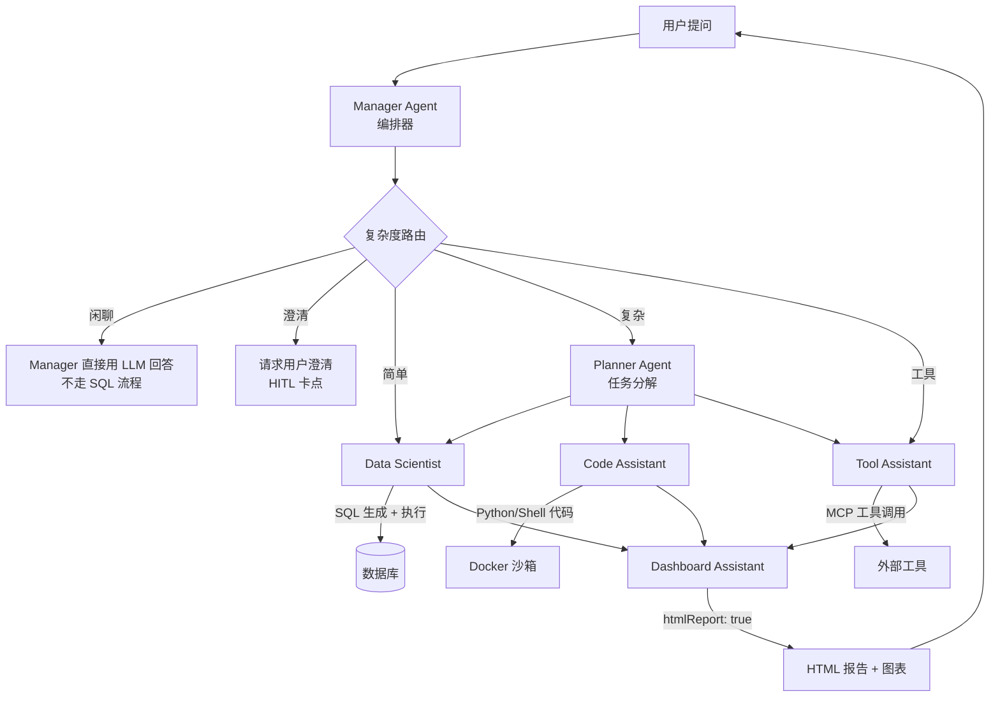
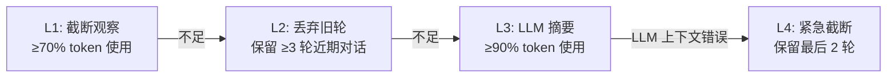

# Must Be The SQL

<p align="center">
  
  
  
  
  
  
</p>

<p align="center">
  <b>Multi-Agent NL2SQL 平台 — 自主数据分析 · LLM 思考模式 · 上下文压缩 · 沙箱代码执行</b>
</p>

<p align="center">
  <a href="./README.md">English</a> |
  <a href="#快速开始">快速开始</a> |
  <a href="#架构设计">架构设计</a> |
  <a href="https://github.com/shixia9/MustBeTheSQL-Server">后端</a>
</p>

---

<!-- 主页截图 -->
<p align="center">
  <em><!-- 系统主页截图占位 --></em>
</p>

---

## 项目简介

Must Be The SQL 是一个 AI 数据助手平台。用户用自然语言描述数据需求，一组专业 AI Agent 协作完成数据库探索、多步执行规划、SQL 生成与修复、沙箱代码分析，最终交付综合报告。

每个 Agent 拥有独立的 LLM 思考过程，推理链路实时流式展示在前端，让用户清晰看到 Agent 的决策逻辑。

### 核心能力

- **多 Agent 协作** — Manager Agent 编排调度专业 Agent（Data Scientist、Code Assistant、Tool Assistant、Dashboard Assistant），各 Agent 自主决策
- **渐进式上下文压缩** — 四层策略（L1–L4）在 token 预算内保持对话连续性，不丢失关键上下文
- **沙箱代码执行** — Python/Shell 脚本在 Docker 隔离沙箱中运行，含安全校验
- **多轮对话** — 上下文自动累积，支持追问、摘要、记忆注入
- **MCP 工具生态** — 内置工具 + Model Context Protocol 外部工具集成
- **人机协同** — 可选的执行计划审批环节，支持自动确认模式
- **多租户工作区** — 用户→工作区两级隔离，4 级角色权限
- **LLM 高可用** — 负载均衡、熔断器、降级链、会话亲和

---

## 架构设计

### Multi-Agent 系统

平台采用多 Agent 架构，**Manager** Agent 接收用户请求并分派给专业 Worker Agent。每个 Agent 拥有独立的 LLM 策略、记忆和动作集。



### Agent 角色

| Agent | 角色 | 能力 |
|-------|------|------|
| **Manager** | 编排器 | 接收用户请求，按复杂度路由，协调 Worker Agent，汇总结果 |
| **Planner** | 任务规划 | 将复杂请求分解为结构化执行计划，逐步分配任务 |
| **Data Scientist** | SQL 专家 | 多候选 SQL 生成、执行、自动修复、图表可视化 |
| **Code Assistant** | 代码工程师 | Python/Shell 代码生成、沙箱执行、数据分析 |
| **Tool Assistant** | 工具专家 | MCP 外部工具发现与调用 |
| **Dashboard Assistant** | 报告生成 | 将执行结果合成为 HTML 报告、仪表盘、摘要 |

### 路由路径

Manager Agent 对每个请求进行分类，走以下五条路径之一：

| 路径 | 触发条件 | 行为 |
|------|---------|------|
| **工具执行** | 用户从 `/` 命令面板选择了「工具」 | 直连 Tool Assistant，跳过复杂度评估 |
| **闲聊** | 问候、通用知识、能力咨询 | Manager 直接用 LLM 回答 — 不走 SQL 流程，不生成报告 |
| **澄清** | 问题模糊或缺少关键信息 | 请求用户澄清（启用 HITL 时为审批卡点） |
| **简单** | 单条 SQL 即可回答 | 直连 Data Scientist（跳过 Planner），再走文本摘要（不生成 HTML 报告） |
| **复杂** | 需要报告/图表/多步分析 | Planner → Workers → Dashboard 全流程（生成 HTML 报告） |

### Agent 间通信

Agent 通过可插拔消息总线通信，支持三种模式（由 `bus-orc.mode` 控制）：

| 模式 | 行为 | 适用场景 |
|------|------|---------|
| `OFF`（默认） | 直接方法调用 | 生产环境 |
| `SWITCH` | 总线中介请求/响应 | 完全总线编排 |

### 上下文压缩

四层渐进式策略在 token 预算内保持对话连续性：



### 沙箱执行

沙箱模块采用四层架构，保障代码执行安全：

| 层 | 职责 |
|----|------|
| **执行层** | `SandboxRuntime`（Docker/Local）— 隔离代码执行 |
| **控制层** | `SandboxControlService` — 会话级锁、生命周期管理 |
| **用户层** | `SandboxController` — 代码提交 REST API |
| **展示层** | `DisplayResult` — 格式化输出供前端渲染 |

安全默认 **fail-closed**：优先 Docker；Local 运行时仅限开发测试。

---

## 项目结构

```
MustBeTheSQL/
├── sql-logic-client/           # 主客户端应用
│   ├── src/
│   │   ├── pages/              #   路由页面（对话、Schema、历史、Agent Studio 等）
│   │   ├── components/
│   │   │   ├── agent/          #   Agent 执行 UI（StepTimeline、ThinkingPanel、OutputPanel 等）
│   │   │   ├── chart/         #   图表可视化
│   │   │   ├── editor/        #   Monaco SQL 编辑器
│   │   │   ├── layout/        #   应用布局、侧边栏、顶部导航
│   │   │   ├── ui/            #   共享 UI 组件
│   │   │   └── workflow/      #   工作流编辑器节点
│   │   ├── stores/            #   Zustand 状态管理（对话、工作区、命令面板）
│   │   ├── contexts/          #   React Context（认证、LLM配置、设置、布局）
│   │   ├── api/               #   HTTP 客户端
│   │   ├── i18n/              #   国际化（中/英）
│   │   └── utils/             #   工具函数（可视化解析、图表分析、导出）
│   ├── vite.config.ts         #   Vite 配置（代理、文档集成）
│   └── package.json
│
├── sql-logic-admin/           # 管理后台
│   ├── src/
│   │   ├── pages/Dashboard.tsx #   概览、用户管理、LLM 监控
│   │   └── App.tsx
│   └── package.json
│
└── sql-logic-docs/            # 文档站点
    ├── docs/
    │   └── guide/             #   Agent 执行、工作流设计、管理后台
    └── docusaurus.config.ts
```

### 页面一览

| 页面 | 路由 | 用途 |
|------|------|------|
| **对话** | `/chat` | 多 Agent 对话界面，含时间线、思考过程和报告 |
| **Schema 浏览** | `/schema-browser` | 数据库浏览 + 多标签 SQL 控制台 |
| **历史** | `/history` | 查询历史 + 对话列表（支持"继续"恢复） |
| **Agent Studio** | `/agent-studio` | Agent 配置（提示词/工具/RAG/记忆） |
| **工作流编辑** | `/flow-editor` | 可视化工作流编辑器 |
| **MCP 服务器** | `/mcp-servers` | MCP 服务器管理（SSE/Stdio） |
| **数据库** | `/database` | 数据库连接管理 |
| **设置** | `/settings` | LLM 配置 + HA 策略 + 记忆管理 |
| **工作区** | `/workspace-manage` | 工作区与成员管理 |
| **知识库** | `/knowledge` | 知识库管理 |
| **技能** | `/skills` | 技能管理 |
| **登录** | `/login` | 认证 + GitHub OAuth |

---

## 平台功能

### 安全认证
- Sa-Token 会话管理（Redis 支持）
- GitHub OAuth 单点登录
- 5 层 SQL 校验链
- 可选限流（30 请求/分钟/用户）

### LLM 高可用
- 4 种负载均衡策略：轮询 / 延迟优先 / 成功率优先 / 智能加权
- 熔断器：连续 5 次失败后开启，30 秒冷却
- 用户可配置降级链
- 会话亲和保持上下文稳定
- 每分钟指标聚合（调用量、成功率、延迟、token 用量）

### 记忆系统
- 四种记忆类型：PROFILE（偏好）、TASK（任务模式）、FACT（业务知识）、EPISODIC（会话上下文）
- pgvector 语义搜索 + SHA256 去重
- 从对话记录自动抽取
- Top-K 相关性注入 Agent 提示词

### RAG 知识
- pgvector 双通道检索：业务术语 + Few-shot 问答对
- 每个 Agent 可配置 Top-K 和分数阈值

### MCP 工具生态
- 4 个内置工具（SQL、Schema、Python、数据采样）
- MCP 协议支持：SSE 传输（远程）和 Stdio 传输（本地 CLI）
- 动态工具发现与注册
- Agent Studio 工具开关控制运行时门控

### SQL 执行安全
- 多层校验：安全检查 → 用户状态 → token 配额
- JSQLParser 语句解析
- AOP SQL 审计日志
- 自动 SQL 修复（最多 2 次重试）

---

## 快速开始

### 前置条件

- Node.js 18+
- pnpm / npm / yarn
- 后端服务已启动（见 [后端 README](https://github.com/shixia9/MustBeTheSQL-Server)）

### 1. 克隆并安装

```bash
git clone https://github.com/shixia9/MustBeTheSQL.git
cd MustBeTheSQL/sql-logic-client
npm install
```

### 2. 启动开发服务器

```bash
# 主客户端
npm run dev

# 管理后台（可选）
cd ../sql-logic-admin
npm install && npm run dev
```

### 4. 生产构建

```bash
npm run build
npm run preview
```

---

## 配置说明

核心配置文件：

| 文件 | 用途 |
|------|------|
| `vite.config.ts` | Vite 配置（开发代理、文档集成、构建选项） |
| `tailwind.config.ts` | Tailwind 主题 + CSS 变量 |
| `i18n/` | 国际化资源（中/英） |

### 环境变量

| 变量 | 默认值 | 说明 |
|------|--------|------|
| `VITE_API_BASE_URL` | `http://localhost:8080` | 后端 API 地址 |
| `VITE_ADMIN_URL` | `http://localhost:5144` | 管理后台地址 |

### 集成方式

前端与后端通过以下方式通信：

| 通道 | 协议 | 用途 |
|------|------|------|
| **Agent SSE 流** | Server-Sent Events | 实时 Agent 执行、思考过程和沙箱输出 |
| **REST API** | JSON over HTTP | 所有非流式操作 |
| **管理后台跳转** | 新标签页 | 跳转至独立管理 SPA |

### SSE 事件类型

| 事件 | 说明 |
|------|------|
| `STARTED` | Agent 节点开始执行 |
| `THINKING` | 流式推理分块（含 `done` 标志） |
| `FINISHED` | Agent 节点执行完成，携带输出 |
| `SANDBOX` | 沙箱代码执行输出（流式） |
| `PLAN_UPDATED` | 执行计划快照更新 |
| `CONTEXT_COMPACT` | 上下文压缩触发（L1–L4） |
| `COMPLETED` | 完整 Agent 运行结束 |

---

## API 接口

### Multi-Agent

| 接口 | 方法 | 用途 |
|------|------|------|
| `/api/v1/agentic/chat/stream` | POST | 启动 Multi-Agent 运行（SSE 流式） |
| `/api/v1/agentic/continue` | POST | 恢复暂停的 HITL 会话（SSE） |
| `/api/v1/sandbox/run` | POST | 在沙箱中执行代码 |

### SQL 与数据库

| 接口 | 方法 | 用途 |
|------|------|------|
| `/api/v1/sql/execute` | POST | 在连接的数据库上执行 SQL |
| `/api/v1/sql/console/execute` | POST | SQL 控制台执行 |
| `/api/v1/database/**` | 各种 | 数据库连接 CRUD + 元数据 |
| `/api/v1/schema/**` | 各种 | Schema 浏览（表/列/索引/DDL） |

### 工作区

| 接口 | 方法 | 用途 |
|------|------|------|
| `/api/v1/workspaces` | GET / POST | 列表 / 创建工作区 |
| `/api/v1/workspaces/{id}/members` | GET / POST | 成员管理 |

### Agent Studio

| 接口 | 方法 | 用途 |
|------|------|------|
| `/api/v1/agent-entity` | CRUD | Agent 配置管理 |
| `/api/v1/agent-entity/{id}/publish` | POST | 发布版本快照 |
| `/api/v1/agent-entity/{id}/versions/{vid}/revert` | POST | 回滚到指定版本 |

### LLM 与记忆

| 接口 | 方法 | 用途 |
|------|------|------|
| `/api/v1/llm-config` | CRUD | LLM 提供商配置 |
| `/api/v1/llm-config/{id}/test` | POST | 测试 LLM 连通性 |
| `/api/v1/llm-config/{id}/strategy` | PUT | HA 策略 + 降级链 |
| `/api/v1/memory/**` | 各种 | 记忆 CRUD + 抽取 |

### MCP 工具

| 接口 | 方法 | 用途 |
|------|------|------|
| `/api/v1/mcp-servers` | GET / POST | 列表 / 添加 MCP 服务器 |
| `/api/v1/mcp-servers/{id}/connect` | POST | 重连 |
| `/api/v1/tools` | GET | 列出已注册工具 |

---

## 技术栈

| 技术 | 用途 |
|------|------|
| React 19 | UI 框架 |
| TypeScript 5.8 | 类型安全开发 |
| Vite 6 | 开发服务器与构建工具 |
| Tailwind CSS 4 | 原子化 CSS，CSS 变量主题系统 |
| Zustand 5 | 轻量状态管理（持久化到 localStorage） |
| Monaco Editor | SQL 代码编辑器 |
| react-markdown + remark-gfm | Agent 报告 Markdown 渲染 |
| lucide-react | 矢量图标库 |
| recharts | 数据可视化图表 |
| shiki | 代码语法高亮 |
| i18next | 国际化（中文 / 英文） |

---

## 附录：功能截图

> 以下区域预留给功能截图，图片将在后续更新中补充。

### 1. 多 Agent 对话界面
<!-- 截图占位：多Agent对话主界面，展示Agent执行时间线、思考过程面板、最终输出 -->

### 2. Agent 思考过程
<!-- 截图占位：Agent思考过程流式展示，打字机效果，可折叠面板 -->

### 3. 上下文压缩可视化
<!-- 截图占位：上下文压缩可视化，L1-L4层级展示，token预算进度环 -->

### 4. 执行计划 TODO 列表
<!-- 截图占位：执行计划TODO列表，步骤状态展示 -->

### 5. SQL 执行与结果
<!-- 截图占位：SQL生成、执行结果表格、图表可视化 -->

### 6. Python 沙箱执行
<!-- 截图占位：代码执行终端，输出展示 -->

### 7. HTML 报告渲染
<!-- 截图占位：Dashboard Agent生成的HTML报告 -->

### 8. Agent Studio 配置
<!-- 截图占位：Agent配置界面，prompt/工具/RAG/内存设置 -->

### 9. 管理后台
<!-- 截图占位：管理后台，用户管理、LLM监控 -->

### 10. 工作空间管理
<!-- 截图占位：多租户工作空间管理 -->
