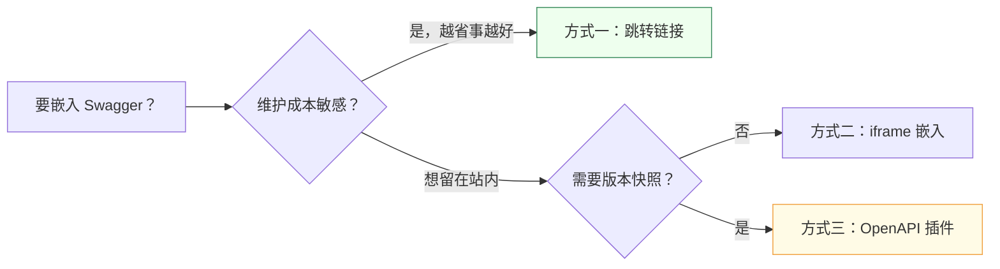

# 嵌入 OpenAPI 文档

把后端 Swagger 与本站结合，有三种方式，按「维护成本从低到高」排列。绝大多数团队用方式一就够了。

## 选型一览



## 方式一：跳转链接（推荐）

**零维护，Swagger 永远最新。** 后端一更新，链接到的内容自动更新。

```markdown
完整接口契约见 [Swagger UI](https://api.example.com/swagger-ui.html)。
```

适合 99% 的场景。只有当你需要「离线」或「版本快照」时，才考虑另外两种。

## 方式二：iframe 嵌入页面

让用户不离开文档站就能调接口。新建一个 `.mdx` 文件：

```mdx
---
title: 在线接口调试
---

import BrowserOnly from '@docusaurus/BrowserOnly';

<BrowserOnly>
  {() => (
    <iframe
      src="https://api.example.com/swagger-ui.html"
      style={{ width: '100%', height: '80vh', border: '1px solid #ddd' }}
      title="Swagger UI"
    />
  )}
</BrowserOnly>
```

:::tip 为什么要用 BrowserOnly
iframe 在构建期无法访问浏览器环境，用 `BrowserOnly` 包裹可以避免构建报错。
:::

:::warning 跨域问题
如果文档站和 Swagger 不同源，浏览器可能拦截。解决办法是用 Nginx 把 `/api/`、`/swagger-ui/` 反代到后端，让两者同源。
:::

## 方式三：Docusaurus OpenAPI 插件

把 OpenAPI 规范「原生」渲染成 Docusaurus 页面，每个接口标签自动生成一个页面。适合需要把接口固化进文档版本的场景。

```bash
npm install --save docusaurus-plugin-openapi-docs
```

把后端导出的 `openapi.json` 放进仓库，插件按标签生成页面。

:::warning 维护成本
这种方式要求「后端每次变更 → 重新导出 openapi.json → 提交到仓库」。如果团队没有自动化这条链路，接口很容易和实际后端脱节。能用方式一就别用方式三。
:::

## 建议

| 你的情况 | 推荐方式 |
| --- | --- |
| 刚起步，人少 | 方式一 |
| 希望体验一体化 | 方式二 |
| 有版本快照 / 离线需求 | 方式三 |

## 下一步

- 回到 [API 概览](/docs/api/overview)
- 部署相关问题 → [排错指引](/docs/faq/troubleshooting)
