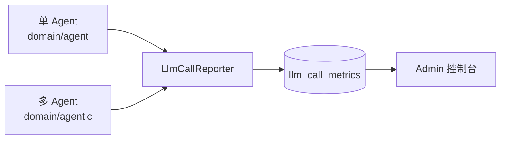

# 后端结构

后端位于 `MustBeTheSQL-Server/`，Maven 多模块工程。通用 DTO 位于 `sql-logic-common`：

```
MustBeTheSQL-Server/
├── sql-logic-common/        # 共享 DTO（如 ConnectorTemplateResponse）
└── sql-logic-{web,service,...}/   # 业务模块
```

## 核心组件

### WorkflowEngine

节点执行调度器。每个节点执行时，引擎必须把节点自身的 `inputsValues` 合并进执行上下文：

```java
// WorkflowEngine.executeNode —— 关键约束
// 必须合并 inputsValues，否则节点画布上的配置数据会丢失
nodeContext.getInputs().putAll(node.getInputsValues());
```

### WorkflowAgentExecutorImpl

Agent 执行实现。DatabaseResource 节点选中表后，通过 `DatabaseMetaDataService` 拉取真实表清单与 DDL 注入 Agent 上下文。

### DatabaseMetaDataService

连接 → Schema → Table 元数据查询服务，前端级联下拉的数据来源。

### Admin 数据层

- `AdminDataService` + `AdminDataProvider`：Admin 控制台数据源。
- DTO 定义在 `AdminDataDTOs.java`：`AgentMetricDTO`、`WorkflowOverviewDTO` 等。
- 暴露端点：
  - `GET /api/v1/admin/llm/metrics/agents` —— 扁平列表，**非分页**。
  - `GET /api/v1/admin/workflows` —— **分页**的 `agent_execution` 记录。

### LLM 指标数据层

`llm_call_metrics` 通过共享的 `LlmCallReporter` 上报，被两套 Agent 执行路径共用：



:::caution 不是数据源迁移
多 Agent 监控是「增量的 per-agent / per-workflow 视图」，`llm_call_metrics` 数据层本身不变。新增 Agent 类型时只需扩展视图，不应改动底层数据结构。
:::

## Swagger / OpenAPI

后端通过 Springdoc 暴露 OpenAPI 规范与 Swagger UI，与本站（产品教程）解耦：

- Swagger UI：`http://localhost:8080/swagger-ui.html`
- OpenAPI JSON：`http://localhost:8080/v3/api-docs`

如何在本站跳转 / 嵌入，见 [API 说明](/docs/api/overview)。
