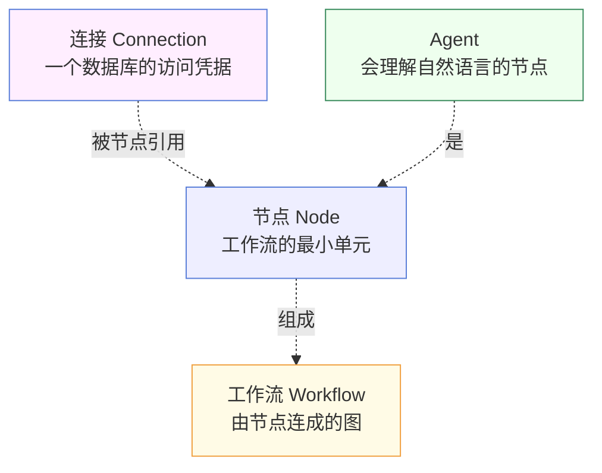
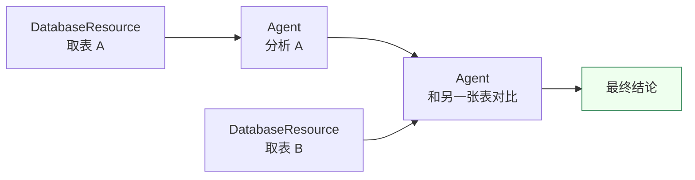
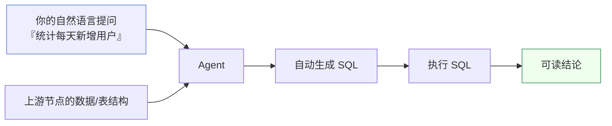
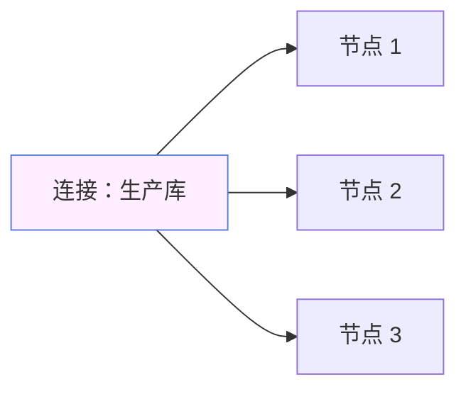

# 核心概念

理解这四个概念，你就掌握了 Must Be The SQL 的全部心智模型：**节点、工作流、Agent、连接**。

## 概念关系一览

## 节点（Node）

节点是工作流的最小积木。**每个节点只负责一件事**，这样才好组合、好复用。常见节点类型：

| 节点 | 职责 | 什么时候用 |
| --- | --- | --- |
| **DatabaseResource** | 从数据库取一张表（含其结构） | 需要真实数据作为输入时 |
| **DataScience** | 数据科学操作 | 需要对数据做加工时 |
| **Agent** | 理解自然语言、生成并执行 SQL | 想用大白话提问时 |

节点之间通过 **连线** 传递数据：上游节点的输出，会成为下游节点的输入。

## 工作流（Workflow）

工作流是「把节点连成一张图」。它定义了两件事：

1. **有哪些节点** 参与；
2. 节点之间的 **执行顺序**（由连线决定）。

上图这个工作流有两条数据来源汇合到一个 Agent——这种「多输入汇聚」正是工作流比线性脚本强大的地方。引擎会自动按拓扑顺序执行：先把两个 DatabaseResource 跑完，再跑依赖它们的 Agent。

## Agent

Agent 是一种特殊节点，它的特别之处在于**听得懂人话**。

Agent 有两种使用方式，对应不同的复杂度：

| 模式 | 适合 | 特点 |
| --- | --- | --- |
| **单 Agent** | 简单、一步到位的提问 | 一个 Agent 完成全部推理 |
| **多 Agent（工作流）** | 多步、需要分阶段的分析 | 多个 Agent 串联/并联，每步结果可复用 |

:::tip 不确定用哪种？
先用单 Agent。当你的问题需要「先做 A，再根据 A 的结果做 B」时，再升级为多 Agent 工作流。详见 [Agent 执行](/docs/guide/agent-execution)。
:::

## 连接（Connection）

连接是节点的「数据来源凭据」。它独立于节点存在，这样设计有两个好处：

1. **一次配置，处处可用** — 同一个数据库连接可以被任意多个节点引用。
2. **凭据集中管理** — 改密码只改一处，所有引用它的节点自动生效。

## 把四个概念串起来

> 你在 **连接管理** 里配置一个数据库 **连接**。
> 在画布上拖出几个 **节点**，数据类节点引用这个连接。
> 用连线把节点连成一张 **工作流**。
> 其中会提问的节点叫 **Agent**。
> 点击运行，引擎按顺序执行，结果回传到时间线。

这就是 Must Be The SQL 的全部。

## 下一步

- 亲手设计一个工作流 → [工作流设计](/docs/guide/workflow-design)
- 深入了解 Agent 的两种模式 → [Agent 执行](/docs/guide/agent-execution)
