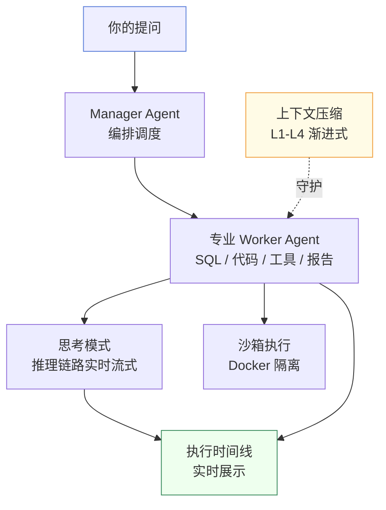
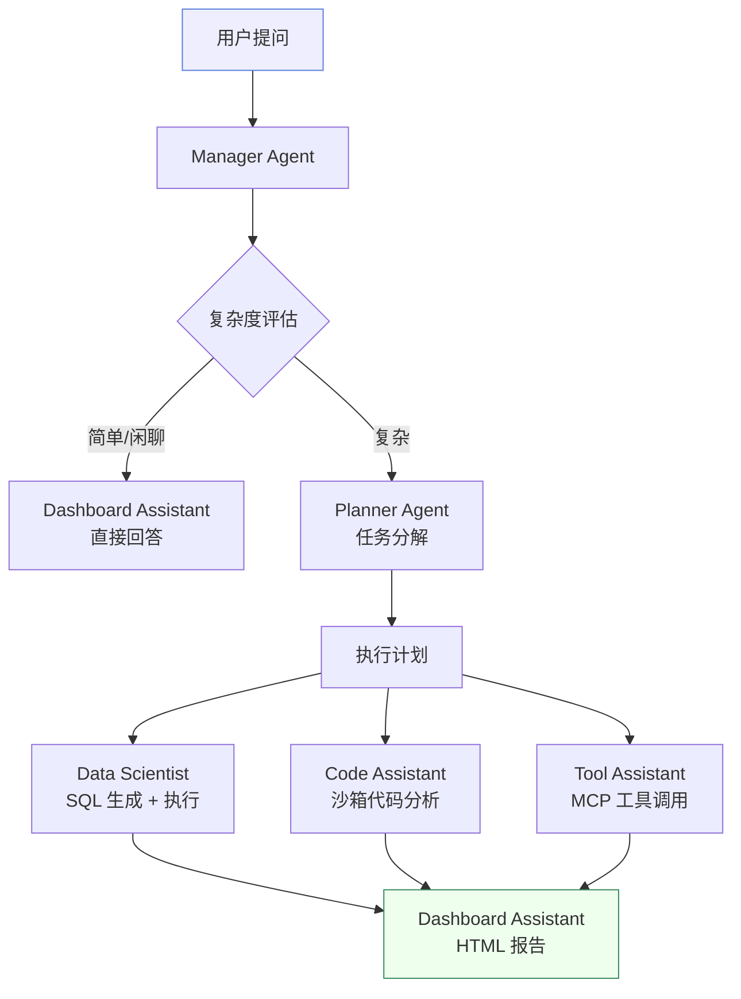
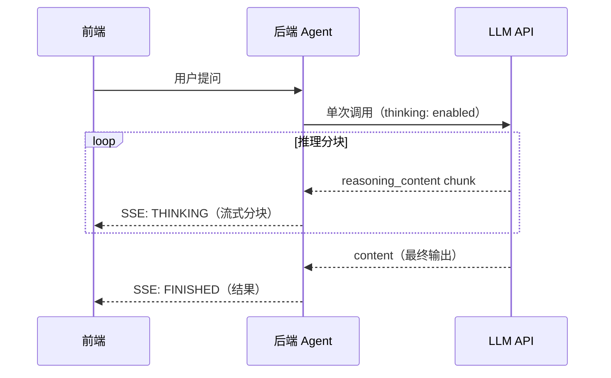
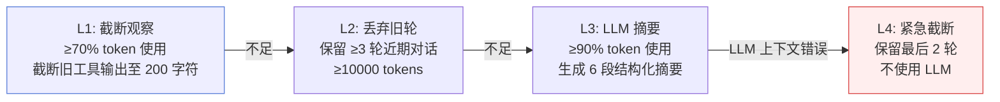
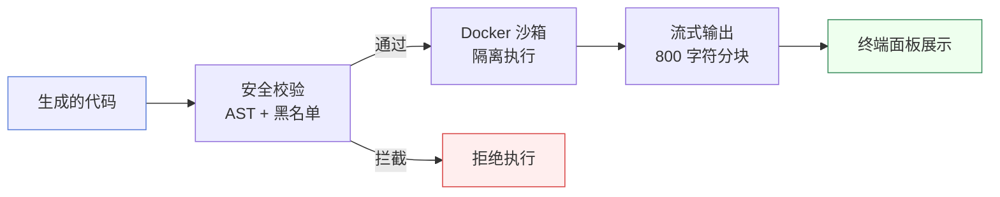

# 核心概念

理解这四个概念，你就掌握了 Must Be The SQL 的全部心智模型：**Multi-Agent 协作、原生思考模式、渐进式上下文压缩、沙箱代码执行**。

## 概念关系一览

## Multi-Agent 协作

平台的核心是**一组专业 AI Agent**，每个 Agent 只擅长一件事。Manager Agent 接收你的提问，按复杂度路由，调度合适的 Worker Agent 协作完成。

### Agent 角色一览

| Agent | 角色 | 能力 |
|-------|------|------|
| **Manager** | 编排器 | 接收用户请求，按复杂度路由，协调 Worker Agent，汇总结果 |
| **Planner** | 任务规划 | 将复杂请求分解为结构化执行计划，逐步分配任务 |
| **Data Scientist** | SQL 专家 | 多候选 SQL 生成、执行、自动修复、图表可视化 |
| **Code Assistant** | 代码工程师 | Python/Shell 代码生成、沙箱执行、数据分析 |
| **Tool Assistant** | 工具专家 | MCP 外部工具发现与调用 |
| **Dashboard Assistant** | 报告生成 | 将执行结果合成为 HTML 报告、仪表盘、摘要 |

:::tip 为什么不用一个全能 Agent？
专业分工让每个 Agent 聚焦自己的领域，提示词更精准，结果更可靠。同时 Manager 可以根据问题复杂度灵活组合——简单问题直接回答，复杂问题才分解调度，避免不必要的开销。
:::

## 原生思考模式

每个 Worker Agent 在执行任务时，会通过 LLM API 的原生思考模式输出推理过程。当 LLM 支持思考模式时（如豆包 `thinking: {type: "enabled"}`、DeepSeek `reasoning_effort`），单次 API 调用同时返回：

- **`reasoning_content`** — 推理链路（chain-of-thought），展示 Agent 的决策逻辑
- **`content`** — 最终输出（SQL、代码、报告等）

推理内容通过 SSE 分块流式推送至前端，实现实时打字机效果——无需额外 LLM 调用。

### 思考面板的交互

- **流式展示** — 推理分块直接渲染为文本增长，带闪烁光标
- **自动折叠** — 推理完成后 800ms 自动折叠
- **未读提示** — 折叠状态下未查看时显示未读徽标
- **手动切换** — 点击标题栏展开/折叠

## 上下文压缩

长对话会逐渐逼近 LLM 的 token 预算。Must Be The SQL 采用**四层渐进式压缩策略**，在不丢失关键上下文的前提下保持对话连续性：

| 层级 | 触发条件 | 动作 | 是否用 LLM |
|------|---------|------|-----------|
| **L1** | ≥70% token 使用 | 截断旧 TOOL 消息内容至 200 字符 | 否 |
| **L2** | L1 不足 | 丢弃旧对话轮次，保留 ≥3 轮近期 | 否 |
| **L3** | ≥90% token 使用 | LLM 生成 6 段结构化摘要替换旧轮 | 是 |
| **L4** | LLM 报告上下文超长 | 紧急截断至最后 2 轮 | 否 |

每次压缩触发时，前端会展示一个**压缩面板**，显示每一层的 token 减少效果。圆形进度环实时反映当前 token 预算使用率，点击可手动触发压缩。

:::tip 为什么要分层？
L1/L2 是轻量操作（无 LLM 调用），快速释放空间；L3 用 LLM 生成摘要保留语义，代价较高但效果好；L4 是最后防线，确保 LLM 不会因上下文超长报错。分层让系统在效率和效果间取得平衡。
:::

## 沙箱代码执行

Code Assistant 生成的 Python/Shell 代码在 **Docker 隔离沙箱**中运行，保障宿主安全。

### 安全机制

- **AST 校验** — Python 代码先经 AST 解析，检查 `import os`、`eval`、`exec` 等危险调用
- **黑名单检测** — Shell 命令检查 `chmod -R`、`curl | bash` 等危险模式（大小写不敏感）
- **字符串字面量保护** — 对 `open(..., 'w')` 等字符串字面量检查在原始代码上运行，避免被字面量剥离误判
- **fail-closed 默认** — 生产环境优先 Docker，未配置时拒绝执行而非回退到宿主

:::warning 沙箱配置
生产环境**切勿**设置 `sandbox.allow-local-runtime=true`。Local 运行时没有 Docker 隔离，仅用于开发测试。
:::

## 把四个概念串起来

> 你用自然语言**提问**。
> **Manager Agent** 评估复杂度，调度专业 **Worker Agent**。
> 每个 Worker Agent 通过**原生思考模式**输出推理链路，实时流式展示。
> Data Scientist 生成并执行 SQL，Code Assistant 在**沙箱**中运行代码。
> **上下文压缩**在背后守护 token 预算，让长对话不中断。
> Dashboard Assistant 将所有结果合成 HTML 报告。

这就是 Must Be The SQL 的全部。

## 下一步

- 深入了解系统架构 → [整体架构](/docs/constructure/overview)
- 了解 Agent 协作细节 → [Agent 执行](/docs/guide/agent-execution)
