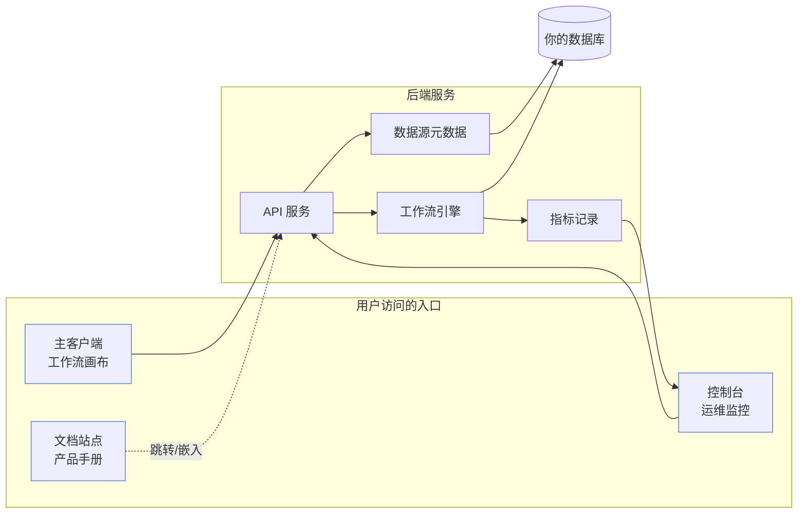
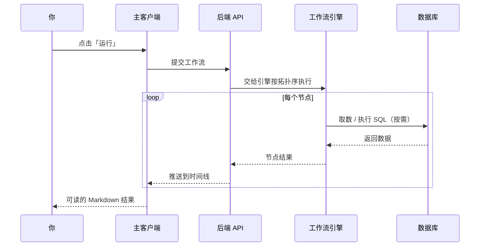
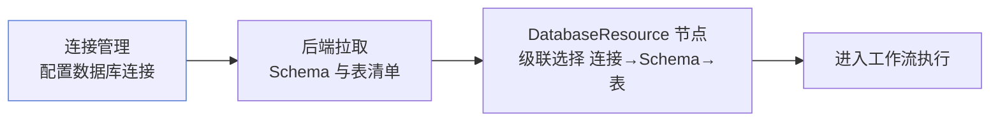

# 整体架构

Must Be The SQL 是一个前后端分离的产品，外加一个独立的文档站点。作为使用者，你只需要记住「三个前端入口 + 一个后端」。

## 系统全景

## 三个入口

| 入口 | 你在这里做什么 |
| --- | --- |
| **主客户端** | 设计工作流、运行工作流、查看结果 |
| **控制台** | 回看执行记录、监控 Agent 与 LLM 调用 |
| **文档站点** | 阅读产品手册（就是你现在看的地方） |

## 一次请求在系统里怎么流转

当你点击「运行」时，背后发生的事：

你看到的「执行时间线」，就是后端把每个节点的结果实时推回前端的结果。

## 数据从哪来

工作流用到的数据不凭空产生。每个数据节点都会连接到你预先配置好的数据源：

这就是为什么你在节点里看到的是「下拉选择」而不是「手填连接串」——表清单是引擎实时从数据库取的，既准确又不易出错。

## 进一步理解

- 想知道节点、工作流、Agent 到底是什么关系？→ [核心概念](/docs/constructure/concepts)
- 想亲手搭一个工作流？→ [工作流设计](/docs/guide/workflow-design)
