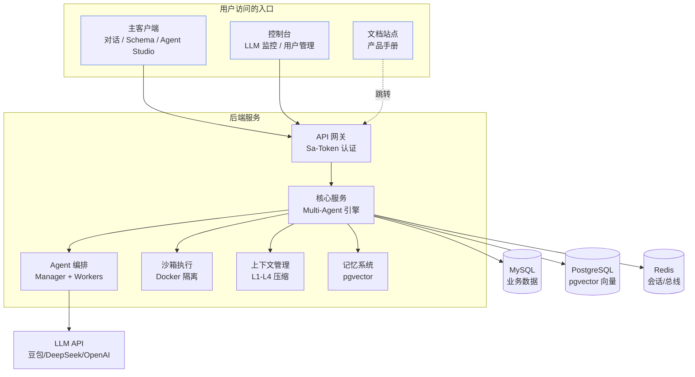
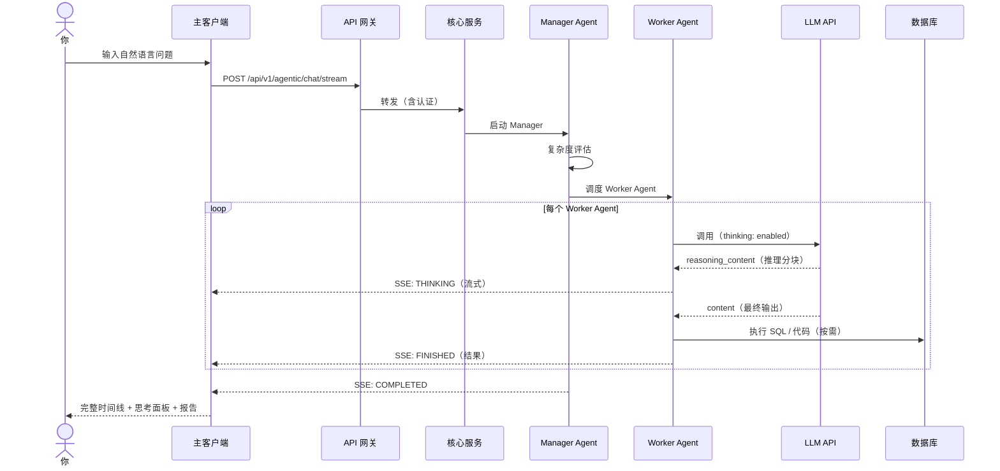
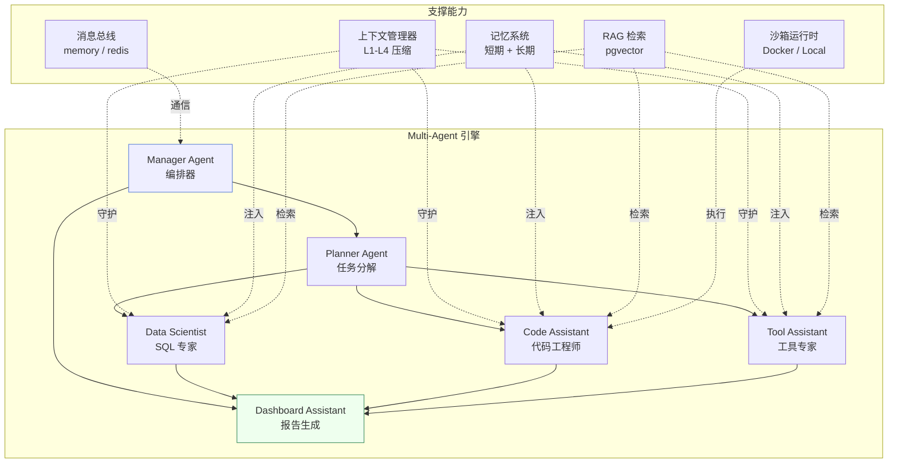

# 整体架构

Must Be The SQL 是一个前后端分离的产品，外加一个独立的文档站点。作为使用者，你只需要记住「三个前端入口 + 一个后端」。

## 系统全景



## 三个入口

| 入口 | 你在这里做什么 |
| --- | --- |
| **主客户端** | 与多 Agent 系统对话、浏览 Schema、配置 Agent、管理工作流 |
| **控制台** | 回看执行记录、监控 Agent 与 LLM 调用、用户管理 |
| **文档站点** | 阅读产品手册（就是你现在看的地方） |

## 一次对话在系统里怎么流转

当你输入问题并发送时，背后发生的事：



你看到的「执行时间线」，就是后端把每个 Agent 的思考过程和执行结果实时推回前端的结果。

## Multi-Agent 系统架构

后端核心是 Multi-Agent 引擎，采用 **Manager-Worker** 模式：



### Agent 间通信

Agent 之间通过可插拔消息总线通信，支持三种模式（由 `bus-orc.mode` 控制）：

| 模式 | 行为 | 适用场景 |
|------|------|---------|
| `OFF`（默认） | 直接方法调用 | 生产环境（零行为变更） |
| `BYPASS` | 直接调用 + 总线镜像 | 观察与调试 |
| `SWITCH` | 总线中介请求/响应 | 完全总线编排 |

## 后端模块结构

```
MustBeTheSQL-Server/
├── sql-logic-common/            # 共享 DTO、异常、工具类
├── sql-logic-service/           # 核心业务逻辑 + Multi-Agent 引擎
│   ├── application/             #   应用服务
│   ├── domain/
│   │   ├── agentic/             #   ★ Multi-Agent 系统
│   │   │   ├── agent/           #     Manager、Planner、DataScientist 等
│   │   │   ├── core/            #     Agent 基类、消息总线
│   │   │   ├── action/          #     SQL、Python、图表、报告动作
│   │   │   ├── context/         #     上下文管理器 + 四层压缩
│   │   │   ├── memory/          #     混合短期 + 长期记忆
│   │   │   ├── routing/         #     复杂度路由
│   │   │   ├── workflow/        #     工作流引擎
│   │   │   └── skill/           #     技能注册表
│   │   ├── sandbox/             #   沙箱代码执行
│   │   ├── conversation/        #   对话历史管理
│   │   └── workspace/           #   多租户工作区
│   ├── infrastructure/          #   DAO、LLM 策略、AOP
│   └── trigger/http/            #   REST 控制器
├── sql-logic-admin/             # 独立管理模块
└── sql-logic-gateway/           # API 网关（Sa-Token）
```

## 平台级能力

### 多租户工作区
- 用户→工作区两级资源隔离
- 4 级角色：OWNER / ADMIN / MEMBER / VIEWER
- 工作区级资源：数据库连接、对话、Agent、知识库

### LLM 高可用
- 4 种负载均衡：轮询 / 延迟优先 / 成功率优先 / 智能加权
- 熔断器：连续 5 次失败后开启，30 秒冷却
- 用户可配置降级链
- 会话亲和保持上下文稳定

### 记忆系统
- 四种记忆类型：PROFILE / TASK / FACT / EPISODIC
- pgvector 语义搜索 + SHA256 去重
- 从对话记录自动抽取，Top-K 注入提示词

### RAG 知识
- pgvector 双通道检索：业务术语 + Few-shot 问答对
- 每个 Agent 可配置 Top-K 和分数阈值

### MCP 工具生态
- 4 个内置工具（SQL、Schema、Python、数据采样）
- MCP 协议支持：SSE 传输（远程）+ Stdio 传输（本地 CLI）
- 动态工具发现与注册

## 进一步理解

- 想知道 Multi-Agent、思考模式、上下文压缩的关系？→ [核心概念](/docs/constructure/concepts)
- 想亲手试一次对话？→ [快速开始](/docs/getting-started/quickstart)
