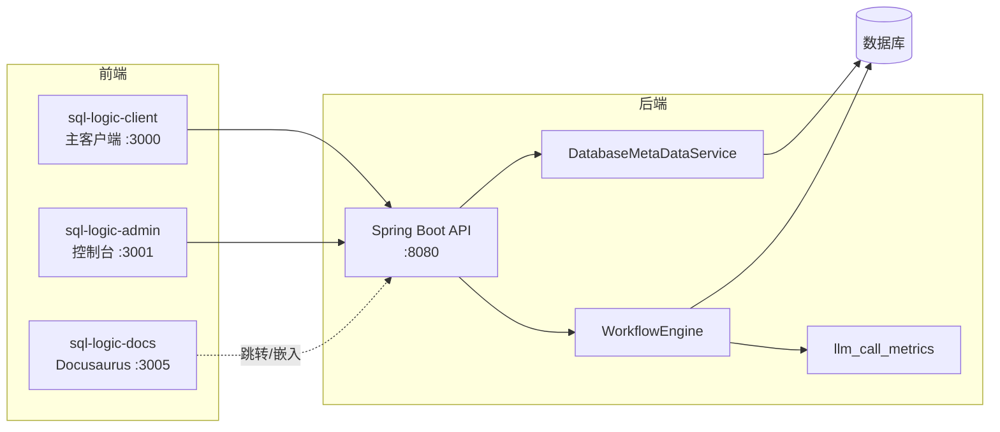

# 架构总览

Must Be The SQL 采用前后端分离架构，文档站点作为第三个独立工程并行存在。

## 三大前端工程

| 工程 | 路径 | 端口 | 职责 |
| --- | --- | --- | --- |
| 主客户端 | `MustBeTheSQL/sql-logic-client` | 3000 | 工作流画布、连接管理、Agent 执行 |
| Admin 控制台 | `MustBeTheSQL/sql-logic-admin` | 3001 | Dashboard、Workflows、LLM Monitor |
| 文档站点 | `sql-logic-docs` | 3005 | 产品使用教程（本站） |

> Admin 控制台是独立的 Vite 应用，拥有自己的 `package.json` / `tsconfig.json`，不与主客户端共享构建配置。

## 后端工程

后端位于 `MustBeTheSQL-Server/`，基于 Spring Boot。关键组件：

- **WorkflowEngine**：节点执行调度，合并 `inputsValues` 以保留节点配置数据。
- **WorkflowAgentExecutorImpl**：Agent 执行实现，调用 `DatabaseMetaDataService` 拉取表元数据。
- **DatabaseMetaDataService**：连接 → Schema → Table 元数据查询。
- **AdminDataService / AdminDataProvider**：Admin 控制台数据源（工作流概览、Agent 指标）。
- **LlmCallReporter**：共享的 LLM 调用上报组件，被单 Agent（`domain/agent`）与多 Agent（`domain/agentic`）共同使用。

## 关键约定

:::warning 硬性约束
- `WorkflowEngine.executeNode` 必须合并节点的 `inputsValues`，否则节点配置会丢失。
- DatabaseResource 节点选中表后，通过 `DatabaseMetaDataService` 拉取真实表清单与 DDL。
- `llm_call_metrics` 数据层被单 Agent 与多 Agent 共用——多 Agent 监控是「增量视图」，不是数据源迁移。
:::

详见 [前端结构](/docs/constructure/frontend) 与 [后端结构](/docs/constructure/backend)。
