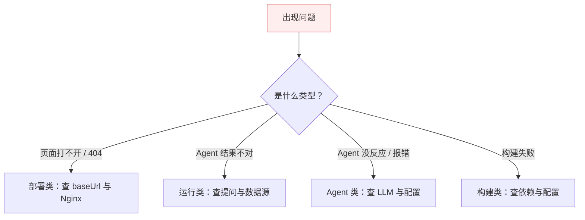
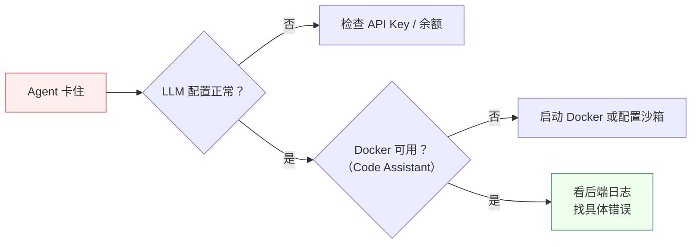
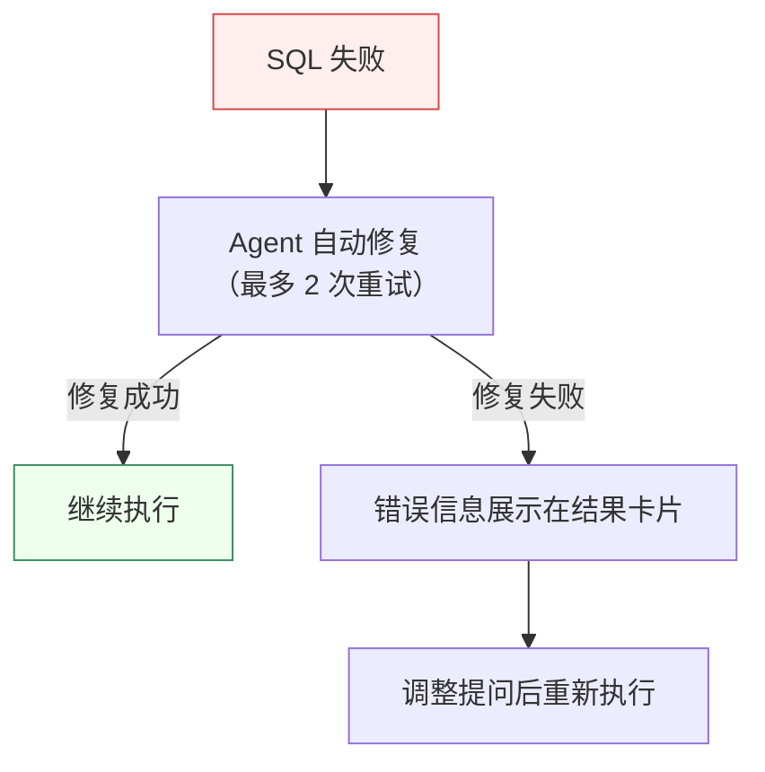

# 排错指引

## 排错思路总览

遇到问题时，按这个顺序定位，能最快找到根因：



## 部署类

### 文档站点访问 404 / 静态资源 404

这是 `baseUrl` 配置不一致的经典陷阱。`baseUrl` 是**构建期**常量，改了必须重新 `npm run build`，运行时改 Nginx 无效。

| 现象 | 原因 | 解决 |
| --- | --- | --- |
| 首页 404 | Nginx 路径与 `baseUrl` 不匹配 | `baseUrl='/docs/'` 时，Nginx 用 `alias` 指向 `build/` |
| JS/CSS 404 | 资源路径前缀缺失 | 确认 `build/` 产物以 `/docs/` 为根，不要剥离前缀 |
| 图片 404 | 用了绝对路径 `/img/x.png` | 改为相对引用 `img/x.png`，由 Docusaurus 加前缀 |

:::warning baseUrl 陷阱
切换部署模式（子路径 ↔ 子域名）时，必须改 `docusaurus.config.ts` 的 `baseUrl` 后重新构建，否则会出现路径错乱或双 `/docs/docs/` 前缀。
:::

### 子域名部署出现 /docs/docs/ 双前缀

子域名模式（`docs.example.com`）必须把 `baseUrl` 从 `/docs/` 改为 `/` 再重新构建，否则 URL 会变成 `docs.example.com/docs/docs/...`。

### 后端启动失败：数据库连接拒绝

检查项：
1. MySQL、PostgreSQL、Redis、Nacos 是否都已启动
2. `application-local.yml` 中的连接凭据是否正确
3. PostgreSQL 是否安装了 pgvector 扩展（`CREATE EXTENSION vector;`）
4. Flyway 迁移脚本版本是否冲突

## 运行类

### Agent 结果不准或答非所问

通常是提问不够具体。参考 [Agent 执行 - 怎么写好提问](/docs/guide/agent-execution#怎么写好提问)，把字段、时间范围、聚合维度、排序都说清楚。

### Agent 一直没有结果

- 检查后端 LLM 配置是否正常（看后端日志是否有调用异常）
- 确认 LLM API Key 有效且有余额
- 在控制台 LLM Monitor 查看该对话的 Agent 步骤是否卡在某一步
- 如果是 Code Assistant 卡住，检查 Docker 是否可用（沙箱执行依赖 Docker）



### 思考过程不显示

- 确认 LLM 支持原生思考模式（豆包、DeepSeek 等）
- 检查 `application-local.yml` 中 thinking 模式相关配置（`thinking-base-url`、`thinking-model-name`、`thinking-api-key`）
- Manager Agent 不输出思考过程是正常的（设计如此）
- 如果所有 Agent 都没有思考过程，可能是 LLM 不支持或配置缺失，系统会静默回退到普通模式

### SQL 执行失败



常见原因：
- 表名/字段名拼写错误（Agent 生成 SQL 时 Schema 信息不完整）
- 数据库账号权限不足
- SQL 语法不兼容目标数据库

### 手动上下文压缩失败

- 检查 LLM 服务是否可用（L3 压缩需要 LLM 调用）
- 查看后端日志中 `compact-context` 端点的错误信息
- 如果对话刚开始（token 使用率很低），可能无可压缩空间

### 沙箱代码执行被拒绝

- 确认 Docker 已安装且正在运行
- 检查 `sandbox.allow-local-runtime` 配置——生产环境应为 `false`
- 查看后端日志是否报安全校验拦截（AST 校验或黑名单检测）

:::warning 安全提示
切勿在生产环境设置 `sandbox.allow-local-runtime=true`。Local 运行时没有 Docker 隔离，代码直接在宿主执行，有安全风险。
:::

### HTML 报告不渲染

- 确认 Dashboard Assistant 已完成（SSE: DASHBOARD FINISHED）
- 检查右侧面板是否已展开
- 如果报告内容为空，可能是 Agent 未生成 HTML——查看思考过程和结果卡片

## 构建类

### 后端构建报错：找不到符号

```bash
# 先安装整个 reactor（父 POM 必须在本地仓库）
cd MustBeTheSQL-Server
mvn install -DskipTests
```

:::tip Maven 路径
如果 `mvn` 命令未找到，需要先 `source ~/.zshrc` 或使用完整路径：
`/Users/.../apache-maven-3.9.16/bin/mvn`
:::

### 前端构建报错：Cannot find module

依赖未安装或版本漂移，清理重装：

```bash
cd MustBeTheSQL/sql-logic-client
rm -rf node_modules package-lock.json
npm install
```

### 文档站点构建报错：Cannot find module '@docusaurus/...'

```bash
cd MustBeTheSQL/sql-logic-docs
rm -rf node_modules build .docusaurus
npm install
```

### Mermaid 图不渲染

确认 `docusaurus.config.ts` 同时启用了：

```ts
themes: ['@docusaurus/theme-mermaid'],
markdown: { mermaid: true },
```

两者缺一不可。

### 本地搜索框不出现

本地搜索需要先 `npm run build` 生成索引。开发模式下首次加载可能稍慢。如果一直不出现，确认 `docsRouteBasePath` 与 docs 插件的 `routeBasePath` 一致。

## 还解决不了？

1. 先在控制台 LLM Monitor 里看错误详情——90% 的问题这里都有线索
2. 对照本页对应分类逐项检查
3. 仍无法解决时，带上「控制台截图 + 出错 Agent 的思考过程 + 后端日志」寻求帮助，信息越完整定位越快
