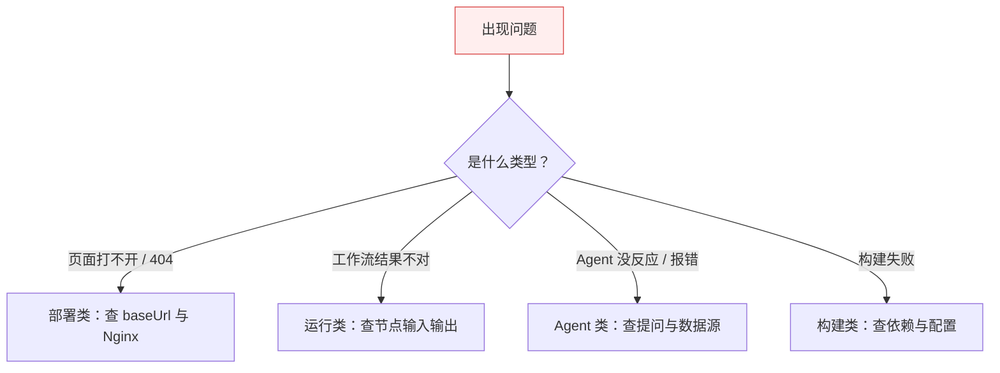

# 排错指引

## 排错思路总览

遇到问题时，按这个顺序定位，能最快找到根因：



## 部署类

### 文档站点访问 404 / 静态资源 404

这是 `baseUrl` 配置不一致的经典陷阱。`baseUrl` 是**构建期**常量，改了必须重新 `npm run build`，运行时改 Nginx 无效。

| 现象 | 原因 | 解决 |
| --- | --- | --- |
| 首页 404 | Nginx 路径与 `baseUrl` 不匹配 | `baseUrl='/docs/'` 时，Nginx 用 `alias` 指向 `build/` |
| JS/CSS 404 | 资源路径前缀缺失 | 确认 `build/` 产物以 `/docs/` 为根，不要剥离前缀 |
| 图片 404 | 用了绝对路径 `/img/x.png` | 改为相对引用 `img/x.png`，由 Docusaurus 加前缀 |

:::warning baseUrl 陷阱
切换部署模式（子路径 ↔ 子域名）时，必须改 `docusaurus.config.ts` 的 `baseUrl` 后重新构建，否则会出现路径错乱或双 `/docs/docs/` 前缀。
:::

### 子域名部署出现 /docs/docs/ 双前缀

子域名模式（`docs.example.com`）必须把 `baseUrl` 从 `/docs/` 改为 `/` 再重新构建，否则 URL 会变成 `docs.example.com/docs/docs/...`。

## 运行类

### DatabaseResource 看不到表清单

1. 确认节点已选中连接；
2. 确认数据库账号对目标 Schema 有查询权限；
3. 在控制台 Workflows 里查看这次执行的错误信息；
4. 确认后端能连通该数据源（看后端日志）。

### 工作流执行失败


绝大多数失败都源于某个节点的输入不对（选错表、提问太模糊），定位到具体节点后改配置重跑即可。

## Agent 类

### Agent 结果不准或答非所问

通常是提问不够具体。参考 [Agent 执行 - 怎么写好提问](/docs/guide/agent-execution#怎么写好提问)，把字段、时间范围、聚合维度、排序都说清楚。

### Agent 一直没有结果

- 检查上游数据节点是否已成功执行（Agent 会等待所有上游就绪）；
- 在控制台查看该 Agent 的步骤是否卡在某一步；
- 确认后端 LLM 配置正常（看后端日志是否有调用异常）。

## 构建类

### 构建报错：Cannot find module '@docusaurus/...'

依赖未安装或版本漂移，清理重装：

```bash
cd MustBeTheSQL/sql-logic-docs
rm -rf node_modules build .docusaurus
npm install
```

### Mermaid 图不渲染

确认 `docusaurus.config.ts` 同时启用了：

```ts
themes: ['@docusaurus/theme-mermaid'],
markdown: { mermaid: true },
```

两者缺一不可。

### 本地搜索框不出现

本地搜索需要先 `npm run build` 生成索引。开发模式下首次加载可能稍慢。如果一直不出现，确认 `docsRouteBasePath` 与 docs 插件的 `routeBasePath` 一致。

## 还解决不了？

1. 先在控制台 Workflows 里看错误详情——90% 的问题这里都有线索；
2. 对照本页对应分类逐项检查；
3. 仍无法解决时，带上「控制台截图 + 出错节点的输入输出」寻求帮助，信息越完整定位越快。
