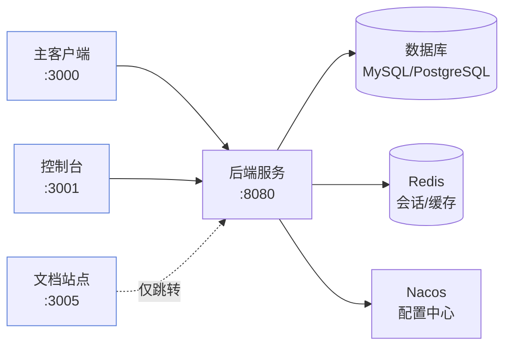

# 安装指南

本章带你把 Must Be The SQL 的全部服务在本地跑起来。整套服务由三部分组成：



## 前置要求

| 工具 | 版本 | 用途 |
| --- | --- | --- |
| Node.js | `>= 18`（推荐 20 LTS） | 运行前端与文档站点 |
| Java JDK | `>= 21` | 运行后端服务（虚拟线程支持并发 Agent） |
| Maven | `>= 3.8` | 构建后端 |
| MySQL | `>= 8.0` | 业务数据库（工作区、对话、配置） |
| PostgreSQL | `>= 14`（含 pgvector 扩展） | 向量检索（RAG、长期记忆） |
| Redis | — | 会话管理、缓存、消息总线 |
| Nacos | — | 配置中心、服务发现 |
| Docker | 可选 | 沙箱代码执行隔离（生产环境推荐） |

:::tip 推荐用版本管理工具
用 [fnm](https://github.com/Schniz/fnm) 或 [nvm](https://github.com/nvm-sh/nvm) 锁定 Node 版本，避免多项目切换造成版本漂移。
:::

## 第一步：获取代码

```bash
git clone https://github.com/must-be-the-sql/SQL-Logic-Engine.git
cd SQL-Logic-Engine
```

## 第二步：启动基础设施

先启动 MySQL、PostgreSQL（含 pgvector）、Redis、Nacos：

```bash
# 如果你用 Docker，可以快速拉起这些依赖
# 示例（请根据实际环境调整）：
docker run -d --name mysql -p 3306:3306 -e MYSQL_ROOT_PASSWORD=xxx mysql:8.0
docker run -d --name postgres -p 5432:5432 -e POSTGRES_PASSWORD=xxx pgvector/pgvector:pg14
docker run -d --name redis -p 6379:6379 redis:7
docker run -d --name nacos -p 8848:8848 -e MODE=standalone nacos/nacos-server:v2.3.0
```

:::warning pgvector 扩展
PostgreSQL 必须安装 pgvector 扩展，否则 RAG 检索和长期记忆功能无法工作。推荐使用 `pgvector/pgvector` 官方镜像。
:::

## 第三步：安装后端

后端是一个 Spring Boot 工程，需要先配置再构建：

```bash
cd MustBeTheSQL-Server

# 复制示例配置并填写凭据
cp sql-logic-service/src/main/resources/application-local.yml.example \
   sql-logic-service/src/main/resources/application-local.yml

# 编辑 application-local.yml，填写数据库连接、LLM API Key 等

# 构建
mvn clean install -DskipTests
```

构建成功后即可启动（下一步统一启动）。

## 第四步：安装前端

前端有两个独立应用，分别安装依赖：

```bash
# 主客户端（对话界面所在）
cd MustBeTheSQL/sql-logic-client
npm install

# 控制台（运维监控视图）
cd ../sql-logic-admin
npm install
```

## 第五步：安装文档站点（可选）

文档站点是独立的 Docusaurus 工程，与业务前端互不依赖：

```bash
cd ../sql-logic-docs
npm install
```

:::info 文档站点 ≠ 业务前端
`sql-logic-docs` 拥有独立的 `package.json` 与 `tsconfig.json`，不嵌入业务代码。开发时通过主客户端的代理，可用 `localhost:3000/docs` 访问。
:::

## 验证安装

逐项构建，全部通过即环境就绪：

```bash
# 后端编译
cd MustBeTheSQL-Server && mvn compile

# 主客户端构建
cd ../MustBeTheSQL/sql-logic-client && npm run build

# 文档站点构建
cd ../sql-logic-docs && npm run build
```

## 下一步

环境就绪后，前往 [快速开始](/docs/getting-started/quickstart) 启动服务并跑通你的第一次多 Agent 对话。
