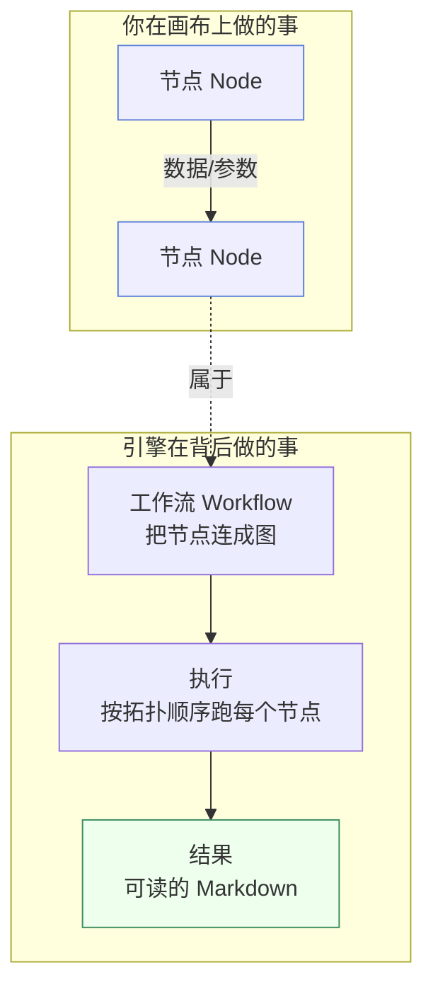

# 产品介绍

## 一句话理解

**Must Be The SQL** 把「连接数据库 → 提问 → 得到结论」这件本该写脚本的事，变成了在画布上拖几个节点。

你不用写 SQL，不用记表名，不用维护一堆 `.sql` 文件——把数据源接进来，用大白话说出你想知道什么，剩下的交给引擎。

## 它为谁设计

| 角色 | 痛点 | 本产品如何帮忙 |
| --- | --- | --- |
| 数据分析师 | 写好的 SQL 难复用、难交接 | 工作流节点化，可保存、可分享、可回溯 |
| 业务运营 | 不懂 SQL，但需要看数据 | 自然语言提问，Agent 自动生成并执行 SQL |
| 数据工程师 | 重复造数据取数轮子 | 把通用逻辑沉淀成可复用节点 |
| 团队管理者 | 不清楚数据探查过程 | 执行时间线 + 控制台全程可观测 |

## 三个核心概念

先建立心智模型，后续操作会非常自然：

- **节点（Node）** — 工作流的最小单元。每种节点干一件事：取数、提问、判断等。
- **工作流（Workflow）** — 一张由节点和连线组成的图，定义了「先做什么、再做什么」。
- **Agent** — 一种会理解自然语言的节点，你告诉它想要什么，它生成并执行 SQL。

> 想深入了解这些概念之间的关系？前往 [核心概念](/docs/constructure/concepts)。

## 它和写脚本相比好在哪

| 维度 | 传统 SQL 脚本 | Must Be The SQL |
| --- | --- | --- |
| 复用 | 复制粘贴改参数 | 工作流当模板，改输入即重跑 |
| 可读性 | 一大段 SQL | 画布上一眼看清流程 |
| 结果呈现 | 一坨表格 / JSON | Markdown 渲染，带结论 |
| 过程追溯 | 只有最终结果 | 每个节点的输入输出都可回看 |
| 上手门槛 | 要会 SQL | 会说话就行 |

## 接下来

- 准备环境 → [安装指南](/docs/getting-started/installation)
- 直接上手 → [快速开始](/docs/getting-started/quickstart)
