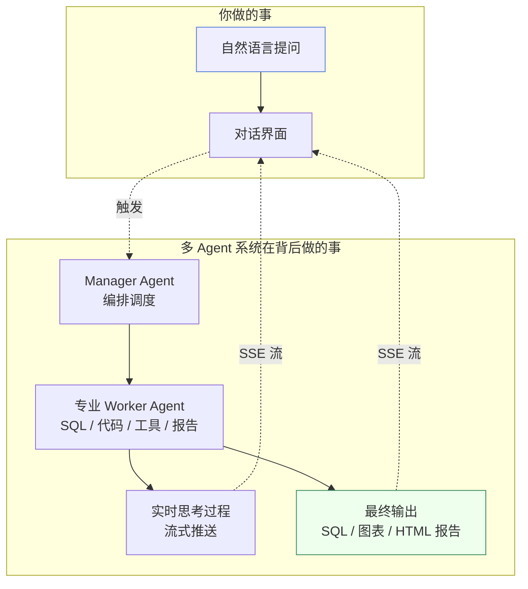

# 产品介绍

## 一句话理解

**Must Be The SQL** 把「连接数据库 → 提问 → 得到结论」这件本该写脚本的事，变成了一段与多 Agent 系统的自然语言对话。

你不用写 SQL，不用记表名，不用维护一堆 `.sql` 文件——把数据源接进来，用大白话说出你想知道什么，一组专业 AI Agent 协作完成探索、生成、执行、分析、报告，全程思考过程可见。

## 它为谁设计

| 角色 | 痛点 | 本产品如何帮忙 |
| --- | --- | --- |
| 数据分析师 | 写好的 SQL 难复用、难交接 | 多轮对话累积上下文，可回看、可继续、可分享 |
| 业务运营 | 不懂 SQL，但需要看数据 | 自然语言提问，Agent 自动生成并执行 SQL |
| 数据工程师 | 重复造数据取数轮子 | 沙箱代码执行 + MCP 工具生态，复用分析逻辑 |
| 团队管理者 | 不清楚数据探查过程 | 执行时间线 + 思考过程透明可见 + 控制台全程可观测 |

## 四个核心概念

先建立心智模型，后续操作会非常自然：

- **Multi-Agent** — Manager Agent 接收提问，按复杂度路由，调度专业 Worker Agent 协作完成
- **思考模式** — 每个 Agent 的 LLM 推理链路通过 SSE 实时流式推送，决策透明可见
- **上下文压缩** — 四层渐进式策略（L1–L4）在 token 预算内保持长对话连续性
- **沙箱执行** — Python/Shell 代码在 Docker 隔离沙箱中运行，保障安全

> 想深入了解这些概念之间的关系？前往 [核心概念](/docs/constructure/concepts)。

## 它和写脚本相比好在哪

| 维度 | 传统 SQL 脚本 | Must Be The SQL |
| --- | --- | --- |
| 交互方式 | 手写 SQL | 自然语言对话 |
| 思考过程 | 不可见 | 每个 Agent 的推理链路实时流式展示 |
| SQL 修复 | 手动调试 | Agent 自动修复（最多 2 次重试） |
| 代码分析 | 另起脚本 | 沙箱直接执行 Python/Shell |
| 结果呈现 | 一坨表格 / JSON | HTML 报告 + 图表 + Markdown |
| 长对话 | 上下文丢失 | 四层渐进式压缩保持连续性 |
| 过程追溯 | 只有最终结果 | 执行时间线 + 思考过程都可回看 |
| 上手门槛 | 要会 SQL | 会说话就行 |

## 接下来

- 准备环境 → [安装指南](/docs/getting-started/installation)
- 直接上手 → [快速开始](/docs/getting-started/quickstart)
