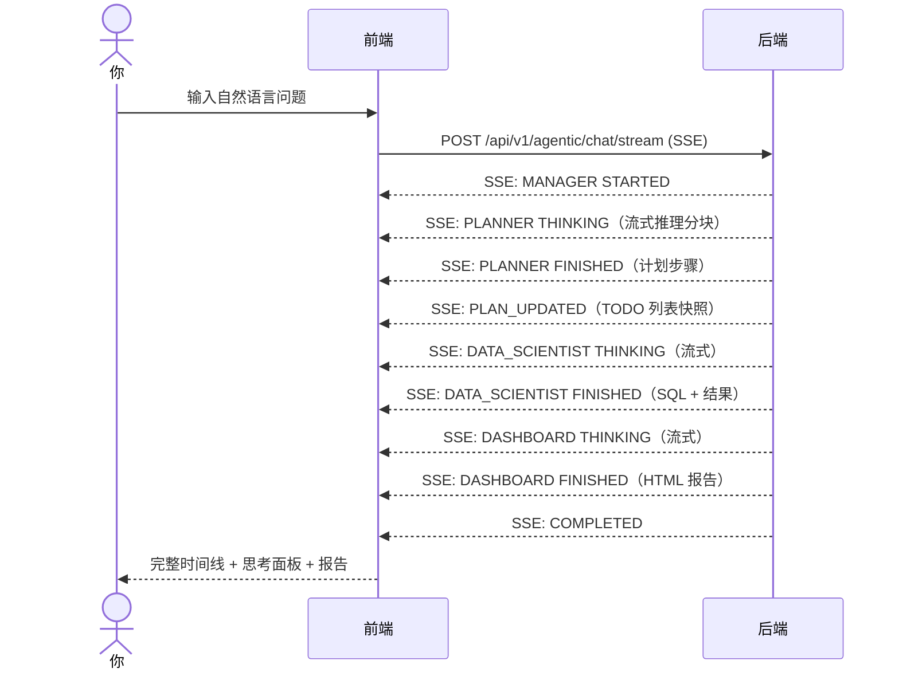

# 快速开始

本章带你启动所有服务，并跑通一个最小但完整的流程：**连接数据库 → 自然语言提问 → 看到多 Agent 协作与思考过程 → 得到可读报告**。

## 1. 启动服务

打开三个终端，分别启动后端、主客户端、控制台：

```bash
# 终端 1 — 后端（默认 :8080，Swagger 在 /swagger-ui.html）
cd MustBeTheSQL-Server
mvn spring-boot:run -pl sql-logic-service

# 终端 2 — 主客户端（:3000）
cd MustBeTheSQL/sql-logic-client
npm run dev

# 终端 3 — 控制台（:3001）
cd MustBeTheSQL/sql-logic-admin
npm run dev
```

| 服务 | 地址 |
| --- | --- |
| 主客户端 | http://localhost:3000 |
| 控制台 | http://localhost:3001 |
| 后端 API | http://localhost:8080 |
| 文档站点（开发） | http://localhost:3000/docs |

:::tip 文档站点的访问方式
开发时文档站点跑在 `:3005`，但主客户端配了代理，所以直接访问 `http://localhost:3000/docs` 即可，与生产路径完全一致。
:::

## 2. 添加一个数据源

1. 打开主客户端 [http://localhost:3000](http://localhost:3000)，登录后进入工作区。
2. 进入 **数据库连接** 页面，新建连接：填写数据库类型、Host、端口、用户名、密码。
3. 点击 **测试连接**，成功后保存。

## 3. 开始第一次对话

进入 **对话** 页面（`/chat`），在输入框用自然语言提问。例如：

> 「统计这张表每天的行数，并按日期升序排列」

按下回车后，你会看到一条终端风格的实时时间线展开：



## 4. 观察思考过程

每个 Agent 执行时，会先展示一段**可折叠的思考面板**：

- **流式打字机效果** — LLM 推理分块通过 SSE 实时到达，文字逐步增长
- **自动折叠** — 推理完成后 800ms 自动折叠，未查看时显示未读徽标
- **状态指示** — 思考中显示旋转加载器，完成时显示绿色勾号

点击思考面板的标题栏可以手动展开/折叠，查看完整的推理链路。

## 5. 查看执行结果

每个 Agent 完成后，结果会出现在时间线对应的步骤卡片中：

- **Planner** — 展示分解后的执行计划 TODO 列表
- **Data Scientist** — 展示生成的 SQL、执行结果表格、自动图表
- **Code Assistant** — 展示沙箱代码执行终端输出
- **Dashboard Assistant** — 在右侧面板渲染 HTML 报告（含图表）

## 6. 回合操作栏

每轮对话结束后，底部会出现一条水平操作栏：

- **上下文进度环** — 显示当前 token 预算使用率，点击可手动触发上下文压缩
- **复制** — 复制该轮 Agent 回复文本
- **重新执行** — 重新执行该轮问题

## 7. 在控制台回看执行情况

打开 [http://localhost:3001](http://localhost:3001) 控制台：

- **Dashboard** — 全局概览，工作流执行总数与成功率
- **LLM Monitor** — 每个 Agent 的步骤级指标、LLM 调用次数与令牌消耗
- **Users** — 用户管理

## 恭喜

你已经跑通了 Must Be The SQL 的核心闭环。接下来推荐：

- 理解你刚才做了什么 → [核心概念](/docs/constructure/concepts)
- 深入了解 Agent 协作机制 → [Agent 执行](/docs/guide/agent-execution)
- 了解上下文压缩如何工作 → [核心概念 - 上下文压缩](/docs/constructure/concepts#上下文压缩)
