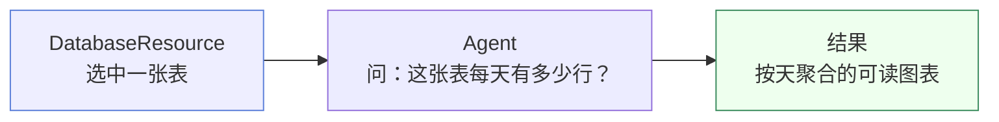

# 快速开始

本章带你启动所有服务，并跑通一个最小但完整的工作流：**连接数据库 → 提问 → 得到可读结论**。

## 1. 启动服务

打开三个终端，分别启动后端、主客户端、控制台：

```bash
# 终端 1 — 后端（默认 :8080，Swagger 在 /swagger-ui.html）
cd MustBeTheSQL-Server
mvn spring-boot:run

# 终端 2 — 主客户端（:3000）
cd MustBeTheSQL/sql-logic-client
npm run dev

# 终端 3 — 控制台（:3001）
cd MustBeTheSQL/sql-logic-admin
npm run dev
```

| 服务 | 地址 |
| --- | --- |
| 主客户端 | http://localhost:3000 |
| 控制台 | http://localhost:3001 |
| 后端 API | http://localhost:8080 |
| 文档站点（开发） | http://localhost:3000/docs |

:::tip 文档站点的访问方式
开发时文档站点跑在 `:3005`，但主客户端配了代理，所以直接访问 `http://localhost:3000/docs` 即可，与生产路径完全一致。
:::

## 2. 添加一个数据源

1. 打开主客户端 [http://localhost:3000](http://localhost:3000)，进入 **连接管理**。
2. 新建连接，填写数据库类型、Host、端口、用户名、密码。
3. 点击 **测试连接**，成功后保存。

## 3. 搭建你的第一个工作流

我们要搭的工作流非常简单：



操作步骤：

1. 进入 **工作流画布**。
2. 从左侧节点面板拖入一个 **DatabaseResource** 节点。
3. 在节点配置里依次选择：**连接 → Schema → 表**。表清单是实时从数据库拉取的，无需手填。
4. 拖入一个 **Agent** 节点，把 DatabaseResource 的输出连到 Agent 的输入。
5. 在 Agent 节点里用自然语言写下你的问题，例如：

   > 「统计这张表每天的行数，并按日期升序排列」

## 4. 运行并查看结果

点击画布右上角的 **运行**。引擎会按连线顺序依次执行节点：

- 每个节点执行完毕后，结果卡片会弹入执行时间线。
- Agent 的输出会以 **Markdown** 渲染，表格、列表、代码块都能正确显示。
- 如果结果无法解析为 Markdown，会回退显示原始 JSON，保证信息不丢失。

:::tip 看不到表清单？
确认 DatabaseResource 节点已选中连接，且数据库账号对目标 Schema 有查询权限。详见 [排错指引](/docs/faq/troubleshooting)。
:::

## 5. 在控制台回看执行情况

打开 [http://localhost:3001](http://localhost:3001) 控制台：

- **Dashboard** — 工作流总览与状态徽标（成功 / 失败 / 运行中）。
- **Workflows** — 每次执行的记录，支持搜索。
- **LLM Monitor → Agents** — 每个 Agent 的步骤级指标。

## 恭喜

你已经跑通了 Must Be The SQL 的核心闭环。接下来推荐：

- 理解你刚才做了什么 → [核心概念](/docs/constructure/concepts)
- 设计更复杂的工作流 → [工作流设计](/docs/guide/workflow-design)
- 了解 Agent 的两种模式 → [Agent 执行](/docs/guide/agent-execution)
