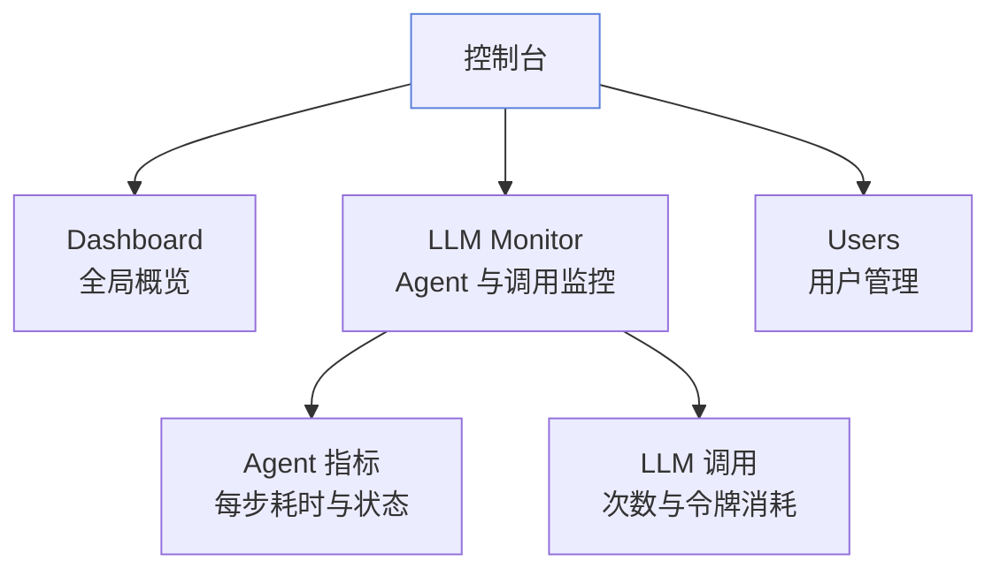
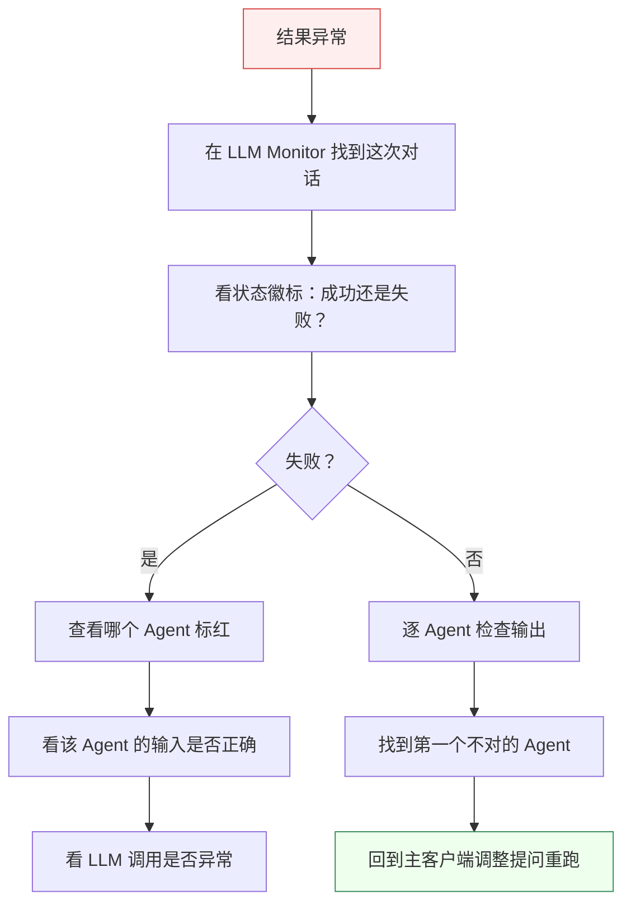

# 控制台

控制台是 Must Be The SQL 的「运维视角」。主客户端用来**做事**，控制台用来**看事**——回看每次执行、监控 Agent 表现、定位问题。

## 控制台能看什么

打开 [http://localhost:3001](http://localhost:3001) 即可访问。

## Dashboard：全局概览

进入控制台第一眼看到的是 Dashboard，给你一个全局快照：

- 工作流执行总数与成功率
- 最近执行的成败状态
- LLM 调用趋势

每条执行记录都有一个状态徽标：

| 徽标 | 含义 |
| --- | --- |
| 🟢 成功 | 多 Agent 对话正常跑完 |
| 🔴 失败 | 某个 Agent 出错，对话中断 |
| 🟡 运行中 / 未知 | 正在执行，或状态未上报 |

## LLM Monitor：Agent 与调用监控

这是控制台的核心视图，专门看 Agent 的「内部表现」：

### Agent 指标

每次多 Agent 对话都会被记录，可查看：

- **每个 Agent 跑了哪些步骤** — Manager → Planner → Data Scientist → Dashboard 等
- **每步耗时与状态** — 哪个 Agent 慢、哪个出错
- **LLM 调用次数与令牌消耗** — token 花在哪了

### 适合回答这些问题

| 问题 | 看哪里 |
|------|--------|
| 「这次执行为什么慢？」 | 哪个 Agent 步骤耗时长 |
| 「Token 花在哪了？」 | 哪个 Agent 调用多、消耗大 |
| 「Agent 是不是在空转？」 | 步骤是否合理、有无重复 |
| 「思考过程有没有触发压缩？」 | 上下文压缩事件记录 |

### LLM 高可用监控

如果配置了多个 LLM 提供商，还可以看到：

- 4 种负载均衡策略的执行情况：轮询 / 延迟优先 / 成功率优先 / 智能加权
- 熔断器状态：连续 5 次失败后开启，30 秒冷却
- 降级链触发：主 LLM 不可用时是否成功降级
- 会话亲和：同一会话是否路由到同一 LLM

## Users：用户管理

管理工作区成员：

- 成员列表与角色（OWNER / ADMIN / MEMBER / VIEWER）
- 邀请新成员加入工作区
- 修改成员角色

## 用控制台排错的标准流程

当某次对话跑出意外结果时，按这个顺序排查：

## 小结

| 想做的事 | 去哪里 |
| --- | --- |
| 看整体健康状况 | Dashboard |
| 分析 Agent 性能与开销 | LLM Monitor → Agent 指标 |
| 查看 LLM 高可用状态 | LLM Monitor → 调用趋势 |
| 定位某次失败 | LLM Monitor → 找标红 Agent |
| 管理工作区成员 | Users |

## 下一步

- 高频问题与排错 → [常见问题](/docs/faq/general)
- 部署与运行问题 → [排错指引](/docs/faq/troubleshooting)
