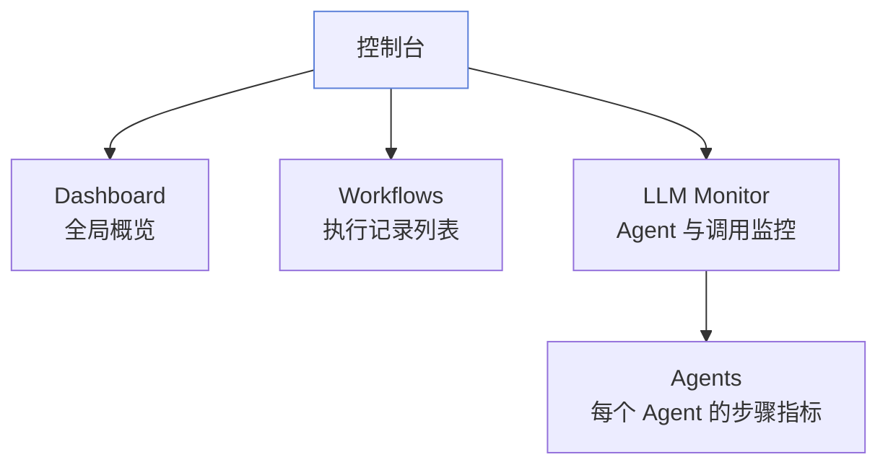
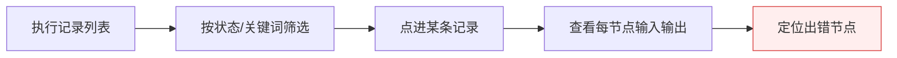
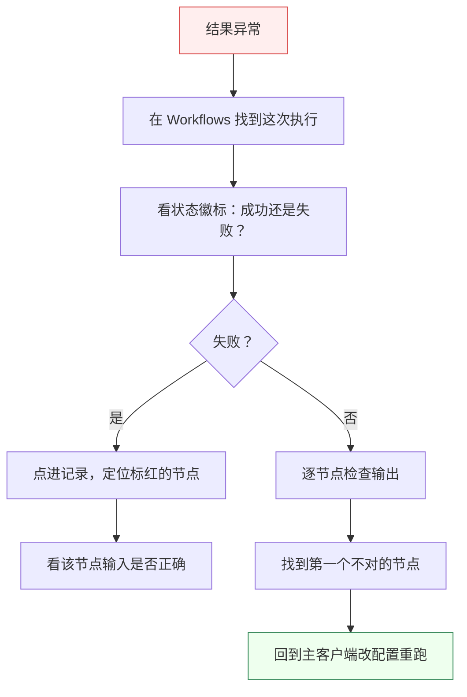

# 控制台

控制台是 Must Be The SQL 的「运维视角」。主客户端用来**做事**，控制台用来**看事**——回看每次执行、监控 Agent 表现、定位问题。

## 控制台能看什么

打开 [http://localhost:3001](http://localhost:3001) 即可访问。

## Dashboard：全局概览

进入控制台第一眼看到的是 Dashboard，给你一个全局快照：

- 工作流执行总数与成功率；
- 最近执行的成败状态；
- LLM 调用趋势。

每条执行记录都有一个状态徽标：

| 徽标 | 含义 |
| --- | --- |
| 🟢 成功 | 工作流正常跑完 |
| 🔴 失败 | 某个节点出错，工作流中断 |
| 🟡 运行中 / 未知 | 正在执行，或状态未上报 |

## Workflows：执行记录

这里以列表形式展示每一次工作流执行，支持搜索：

- 按状态筛选（成功 / 失败 / 运行中）；
- 按关键词搜索工作流名称；
- 分页浏览历史记录。

点进某条记录，可以看到这次执行里每个节点的输入输出——这是排错的核心入口。

## LLM Monitor → Agents

这个视图专门看 Agent 的「内部表现」：

- 每个 Agent 跑了哪些步骤；
- 每步耗时与状态；
- LLM 调用次数与令牌消耗。

适合回答这些问题：

- 「这次执行为什么慢？」→ 看哪一步耗时长。
- 「Token 花在哪了？」→ 看哪个 Agent 调用多。
- 「Agent 是不是在空转？」→ 看步骤是否合理。

## 用控制台排错的标准流程

当某个工作流跑出意外结果时，按这个顺序排查：

## 小结

| 想做的事 | 去哪里 |
| --- | --- |
| 看整体健康状况 | Dashboard |
| 翻历史执行记录 | Workflows |
| 分析 Agent 性能与开销 | LLM Monitor → Agents |
| 定位某次失败 | Workflows → 点进记录 → 找标红节点 |

## 下一步

- 高频问题与排错 → [常见问题](/docs/faq/general)
- 部署与运行问题 → [排错指引](/docs/faq/troubleshooting)
