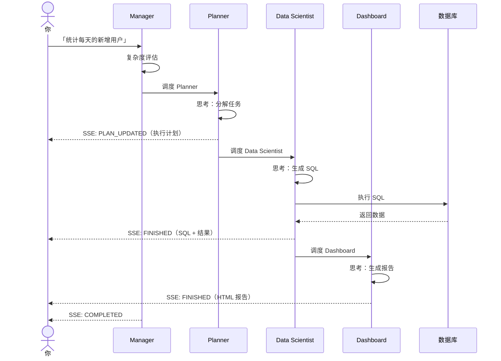
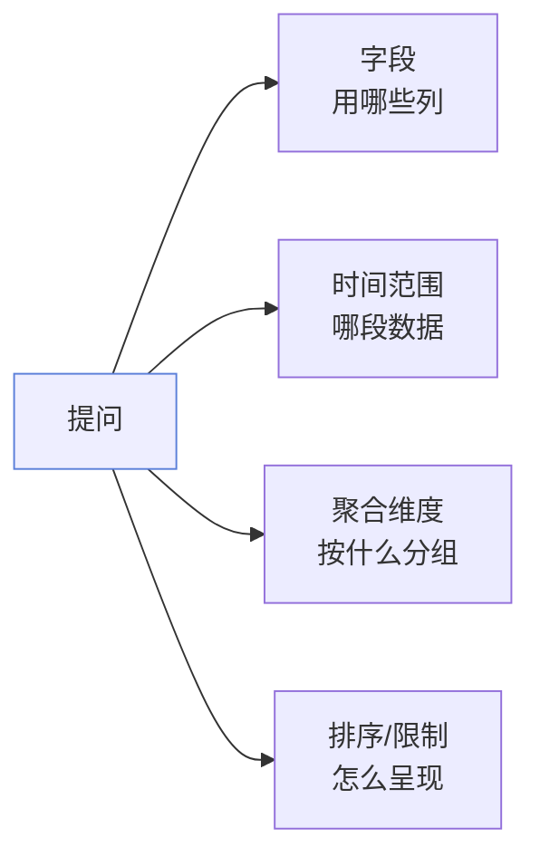
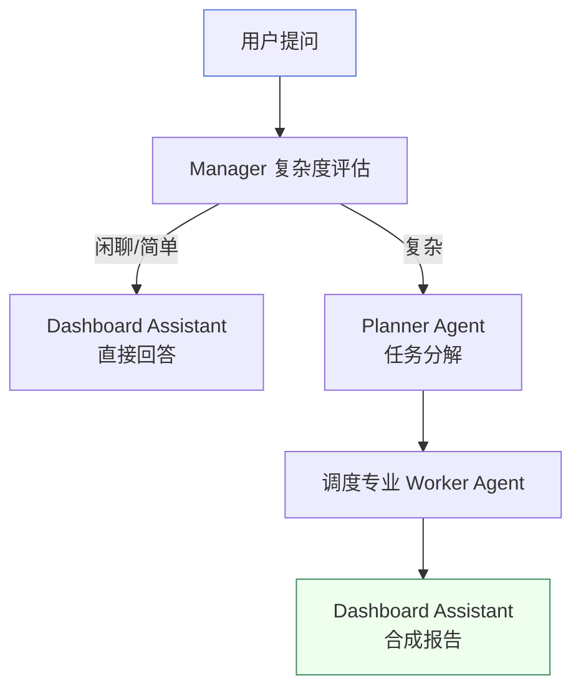
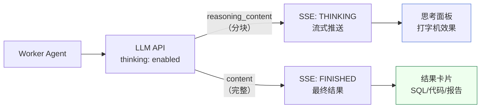
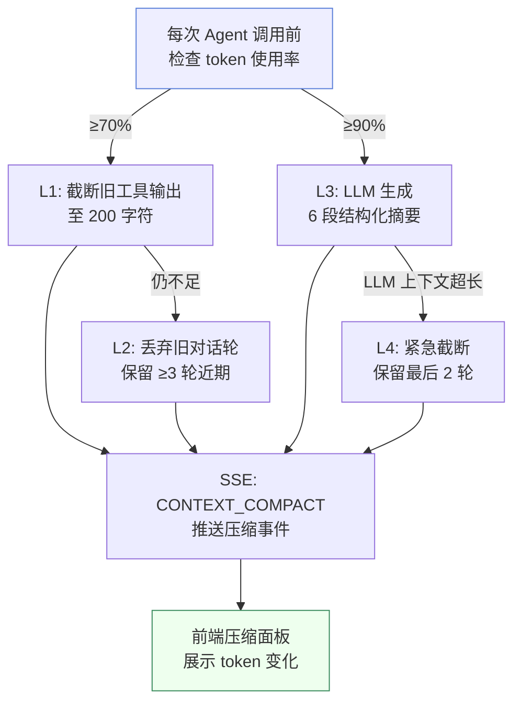
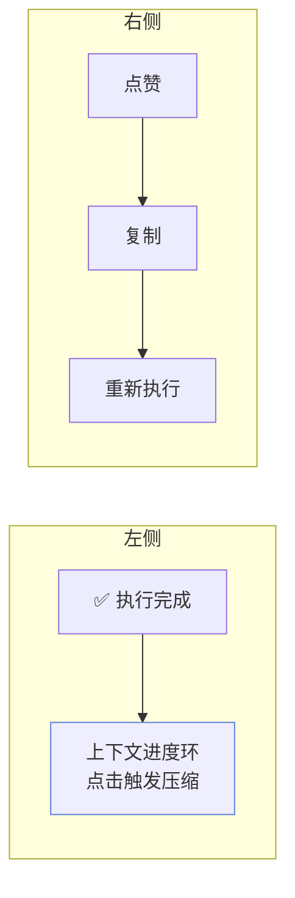

# Agent 执行

本章讲清楚三件事：**多 Agent 如何协作**、**思考过程怎么看**、**上下文压缩如何守护长对话**。

## Agent 在做什么

当你发送一句提问，Manager Agent 背后做的事：

你只负责「问」，Manager Agent 负责「评估 + 调度 + 汇总」。

## 怎么写好提问

Agent 的质量，七成取决于你的提问写得清不清楚。一个好提问包含四要素：

**示例对比：**

| 模糊提问 | 清晰提问 |
| --- | --- |
| 看看销售情况 | 统计每个品类本月的销售额，按金额降序取前 10 |
| 用户活跃度怎样 | 计算最近 7 天每天登录用户数，按日期升序 |
| 有异常吗 | 找出金额超过平均值 3 倍的订单 |

## 复杂度路由

Manager Agent 会先评估你的问题复杂度，决定调度路径：

| 复杂度 | 路径 | 示例 |
|--------|------|------|
| **闲聊** | Dashboard 直接回答 | 「你好」、「你是谁」 |
| **简单** | Dashboard 直接回答 | 「这张表有多少行」 |
| **复杂** | Planner → Workers → Dashboard | 「分析最近一个月的销售趋势并给出建议」 |

## 思考过程

每个 Worker Agent 执行时，会先通过 LLM 原生思考模式输出推理链路，然后才产出最终结果。

### 流式思考展示

### 思考面板交互

| 状态 | 表现 |
|------|------|
| **思考中** | 旋转加载器 + 闪烁光标 + 文字逐步增长 |
| **完成** | 绿色勾号 + 800ms 后自动折叠 |
| **折叠未读** | 灰色未读徽标 + 点击展开 |
| **已查看** | 无徽标，点击可重新展开 |

:::tip Manager 不输出思考
Manager Agent 的决策逻辑不对外展示（`shouldEmitThinking() = false`），避免编排噪声。只有专业 Worker Agent 的推理过程才会流式展示。
:::

## 上下文压缩

长对话会逐渐逼近 LLM 的 token 预算。系统在后台自动执行四层渐进式压缩：

### 压缩面板

每次压缩触发时，前端会弹出压缩面板，展示：
- 触发的层级（L1/L2/L3/L4）
- 压缩前后的 token 数量
- 压缩策略说明

### 手动压缩

回合操作栏中的**圆形进度环**实时显示当前 token 预算使用率：

- **低于 50%** — 绿色，空间充足
- **50-80%** — 琥珀色，注意
- **高于 80%** — 红色，建议压缩

点击进度环可手动触发上下文压缩，系统会根据当前使用率选择最合适的压缩层级。

## 结果是怎么呈现的

每个 Agent 完成后，结果出现在时间线对应的步骤卡片中：

| Agent | 结果类型 | 展示方式 |
|-------|---------|---------|
| **Planner** | 执行计划 | TODO 列表，步骤状态跟踪 |
| **Data Scientist** | SQL + 结果 | SQL 代码块 + 结果表格 + 自动图表 |
| **Code Assistant** | 代码执行 | 代码标签 + 终端输出标签 |
| **Tool Assistant** | 工具调用 | 工具名称 + 调用结果 |
| **Dashboard Assistant** | HTML 报告 | 右侧面板 iframe 渲染 |

### SQL 结果

Data Scientist 的输出包含：
- 生成的 SQL（语法高亮）
- 执行结果表格
- 自动图表可视化（recharts）
- 如果 SQL 执行失败，会自动修复并重试（最多 2 次）

### 沙箱代码输出

Code Assistant 生成的 Python/Shell 代码在 Docker 沙箱中执行，输出在终端风格面板展示：
- 深色终端配色（不受应用主题影响）
- SSE 流式输出（800 字符分块）
- 代码标签 + 终端标签切换

### HTML 报告

Dashboard Assistant 将所有结果合成 HTML 报告，在右侧专用面板中渲染：
- 自动检测 HTML 内容
- iframe 隔离渲染
- 支持图表、表格、样式

## 回合操作栏

每轮对话结束后，底部出现水平操作栏：

- **上下文进度环** — 点击弹出压缩确认框，手动触发压缩
- **复制** — 复制该轮 Agent 回复文本（自动提取 report → content → sql → toolResult）
- **重新执行** — 重新执行该轮问题

## 在控制台看 Agent 指标

每次 Agent 执行都会被记录，可在控制台查看：

- 每个 Agent 的步骤耗时与状态
- LLM 调用次数与令牌消耗
- 整个对话的执行概览

详见 [控制台](/docs/guide/admin-dashboard)。

## 下一步

- 回看执行与监控 → [控制台](/docs/guide/admin-dashboard)
- 遇到问题 → [排错指引](/docs/faq/troubleshooting)
