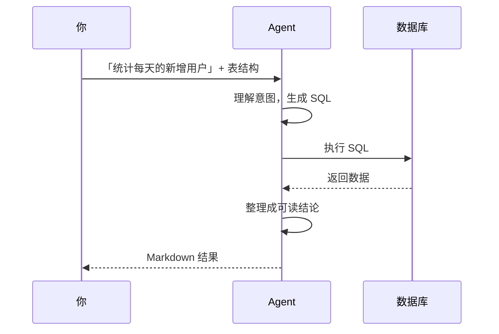
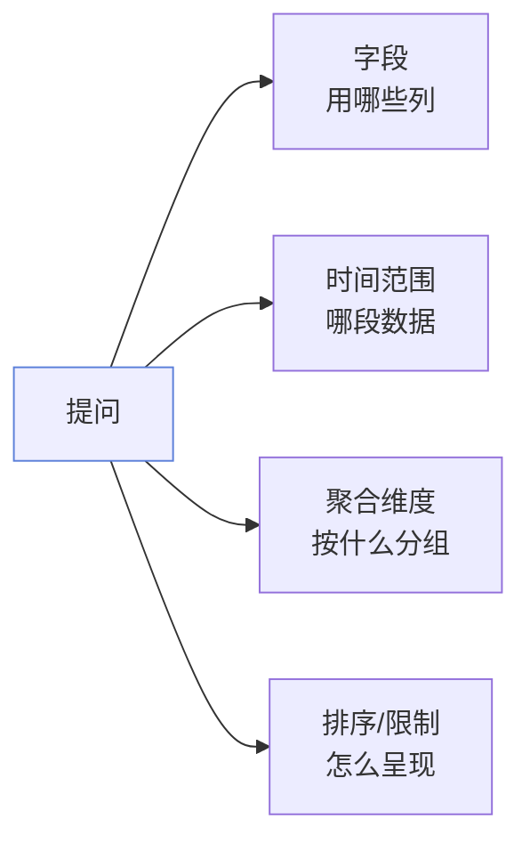
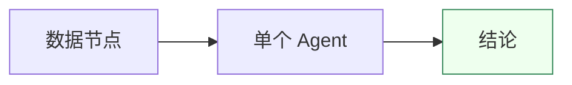
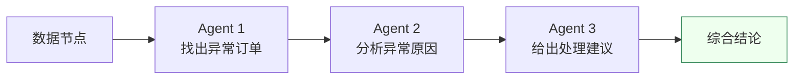

# Agent 执行

Agent 是 Must Be The SQL 里「会听人话」的节点。本章讲清楚两件事：**怎么用好一个 Agent**，以及**什么时候该用多个 Agent**。

## Agent 在做什么

当你给 Agent 一句提问，它背后做的事：

你只负责「问」，Agent 负责「查 + 整理 + 表达」。

## 怎么写好提问

Agent 的质量，七成取决于你的提问写得清不清楚。一个好提问包含四要素：

**示例对比：**

| 模糊提问 | 清晰提问 |
| --- | --- |
| 看看销售情况 | 统计每个品类本月的销售额，按金额降序取前 10 |
| 用户活跃度怎样 | 计算最近 7 天每天登录用户数，按日期升序 |
| 有异常吗 | 找出金额超过平均值 3 倍的订单 |

## 单 Agent 模式

**适合：一步到位的问题。** 一个 Agent 从头到尾完成推理、执行、整理。

如果你要问的问题能用一句话说清，且不需要中间结果，就用单 Agent。这是 90% 的场景。

## 多 Agent 模式（工作流）

**适合：需要分阶段、且后一步依赖前一步结果的问题。**

什么时候升级到多 Agent：

| 信号 | 说明 |
| --- | --- |
| 提问里有「先……再……」 | 天然是两步 |
| 中间结果本身也有用 | 想单独看每步结论 |
| 一次问太多 Agent 答不准 | 拆成小步，每步更聚焦 |
| 不同步骤需要不同数据 | 各 Agent 各接各的数据源 |

:::tip 不要过度拆分
每个 Agent 都有调用成本。如果两步之间没有「依赖」关系，合并成一个 Agent 通常更快更省。只有真有依赖时才拆。
:::

## 结果是怎么呈现的

Agent 的原始输出是结构化数据，但你在时间线里看到的是**渲染过的 Markdown**：

- **表格** — 适合多行多列的结果。
- **列表** — 适合枚举类结论。
- **代码块** — 适合展示生成的 SQL 本身。
- **回退 JSON** — 当无法解析为 Markdown 时，原样展示，保证信息不丢。

## 在控制台看 Agent 指标

每次 Agent 执行都会被记录，可在控制台查看：

- 每个步骤的耗时与状态；
- LLM 调用次数与令牌消耗；
- 整个工作流的执行概览。

详见 [控制台](/docs/guide/admin-dashboard)。

## 下一步

- 回看执行与监控 → [控制台](/docs/guide/admin-dashboard)
- 遇到问题 → [排错指引](/docs/faq/troubleshooting)
