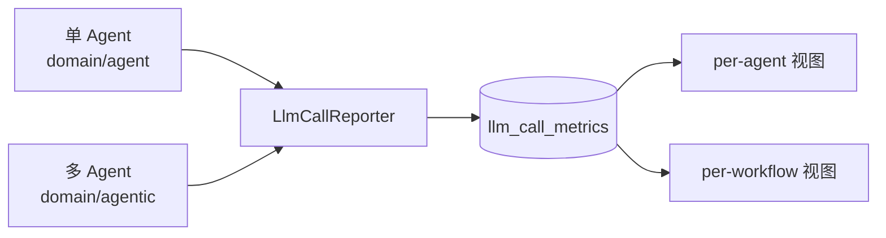

# Agent 执行

Must Be The SQL 支持两种 Agent 执行模式：

| 模式 | 包路径 | 适用场景 |
| --- | --- | --- |
| 单 Agent | `domain/agent` | 线性、单步推理任务 |
| 多 Agent（agentic workflow） | `domain/agentic` | 多步编排、需要 per-agent / per-workflow 视图 |

两者共享同一套 LLM 调用上报机制。

## 共享数据层

无论哪种模式，LLM 调用都通过共享的 `LlmCallReporter` 上报到 `llm_call_metrics`：

:::warning 关键认知
多 Agent 监控是**增量视图**，不是数据源迁移。`llm_call_metrics` 表结构稳定，新增 Agent 类型只需在 Admin 控制台扩展视图层，不要改动底层数据结构。
:::

## 单 Agent

- 一个 Agent 节点完成全部推理。
- 输出进入执行时间线，Markdown 渲染。

## 多 Agent（agentic workflow）

- 多个 Agent 节点串联 / 并联，形成工作流图。
- 每个 Agent 的步骤级指标记录在 `agent_execution_step` 表。
- Admin 控制台 **LLM Monitor → Agents** 展示 per-agent 步骤指标（非分页）。

## 执行结果可读性

Agent 输出默认是结构化 JSON，本平台通过 `ExecutionTimelineModal.tsx` 的 `formatOutput` 把结果渲染为人类可读的 Markdown：

- 优先用 `react-markdown` + `remark-gfm` 渲染。
- 表格、列表、代码块都能正确呈现。
- 无法解析为 Markdown 时，回退为 `<pre>` 展示原始 JSON，保证信息不丢失。

下一步：[Admin 控制台](/docs/guide/admin-dashboard)。
