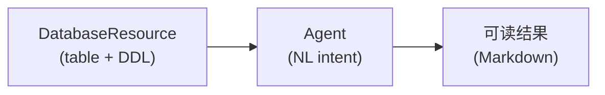

# 工作流设计

工作流画布是 Must Be The SQL 的核心交互界面。本章介绍节点类型、连线规则与数据流转。

## 节点类型

| 节点 | 作用 | 关键配置 |
| --- | --- | --- |
| **DataScience** | 数据科学操作节点 | 连接 → Schema → Table 级联选择 |
| **DatabaseResource** | 数据库资源节点 | 选中表后自动拉取表清单与 DDL |
| **Agent** | Agent 执行节点 | 接收上游输出作为上下文 |

:::info 级联下拉
DataScience 与 DatabaseResource 节点使用「连接 → Schema → Table」三级级联下拉，而不是文本输入连接 ID。表清单来自后端 `DatabaseMetaDataService`。
:::

## 添加节点

1. 从左侧节点面板拖拽节点到画布。
2. 选中节点，右侧 `NodeConfigPanel.tsx` 面板展开配置项。
3. 对于 DataScience / DatabaseResource：先选连接，再选 Schema，最后选 Table。
4. 选中 Table 后，后端拉取该表的 DDL 注入节点上下文。

## 连线与数据流

- 从上游节点的输出端口拖到下游节点的输入端口。
- 下游节点的 `inputsValues` 会被引擎合并进执行上下文。
- Agent 节点可以把上游 DatabaseResource 的输出（表数据 / DDL）作为自然语言意图的素材。

## 执行

点击画布右上角 **运行**，工作流从入度 0 的节点开始按拓扑序执行。每个节点执行完成后，结果进入执行时间线。

### 时间线行为

- 卡片使用 `motion.div` 入场动画：`opacity 0→1`、`y 10→0`、280ms ease-out。
- React key 使用稳定的 `entry.nodeId`，避免状态切换时的重复节点。
- 结果由 `formatOutput` 用 `react-markdown` + `remark-gfm` 渲染；无法解析为 Markdown 时回退为 `<pre>` 展示原始 JSON。

:::tip 保留配置
`WorkflowEngine.executeNode` 必须合并节点的 `inputsValues`，否则画布上配置的连接、Schema、Table 等数据会在执行中丢失。
:::

下一步：[Agent 执行](/docs/guide/agent-execution)。
