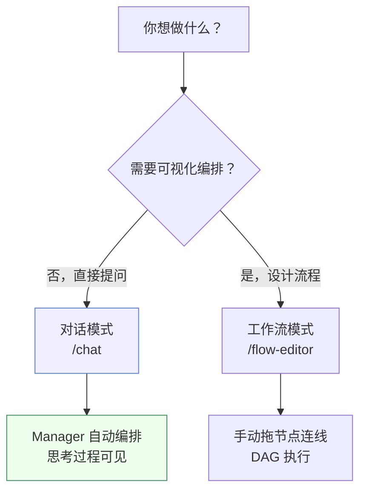
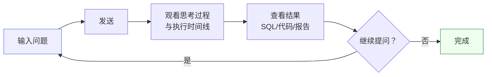
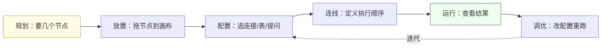
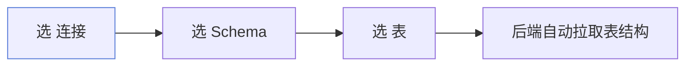
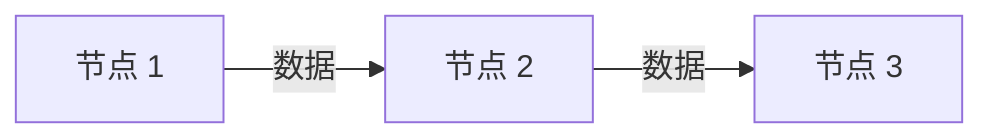
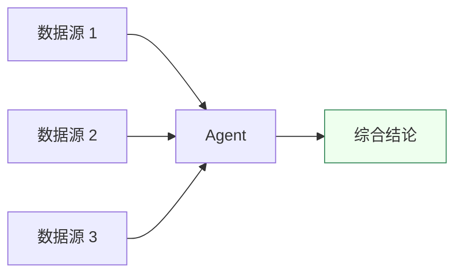

# 对话与工作流

Must Be The SQL 提供两种与多 Agent 系统交互的方式：**自然语言对话**（主入口）和**可视化工作流**（进阶）。

## 两种交互方式

## 对话模式（推荐）

**适合 90% 的场景。** 直接在对话页面用自然语言提问，Manager Agent 自动编排。

### 优势

- **零配置** — 不需要设计流程，直接问
- **思考可见** — 每个 Agent 的推理过程实时展示
- **上下文累积** — 多轮对话自动保持上下文，支持追问
- **自动压缩** — 长对话自动触发上下文压缩，不中断
- **复杂度自适应** — 简单问题直接回答，复杂问题自动分解

### 使用流程

### 提问技巧

| 场景 | 模糊提问 | 清晰提问 |
|------|---------|---------|
| 销售分析 | 看看销售情况 | 统计每个品类本月的销售额，按金额降序取前 10 |
| 用户活跃 | 用户活跃度怎样 | 计算最近 7 天每天登录用户数，按日期升序 |
| 异常检测 | 有异常吗 | 找出金额超过平均值 3 倍的订单 |
| 趋势分析 | 分析一下趋势 | 计算最近 30 天每天的订单量，画出趋势线 |

:::tip 追问
对话模式支持多轮追问。例如先问「统计每天新增用户」，再追问「按周聚合呢？」——Agent 会自动理解上下文。
:::

## 工作流模式（进阶）

**适合需要可视化编排、固定流程复用的场景。** 在画布上拖节点、连线，定义数据流和执行顺序。

### 适用场景

- 固定分析流程需要反复执行
- 多数据源汇聚到一个 Agent
- 需要保存和分享分析流程模板

### 节点类型

| 节点 | 职责 | 什么时候用 |
|------|------|-----------|
| **DatabaseResource** | 从数据库取一张表（含结构） | 需要真实数据作为输入时 |
| **DataScience** | 数据科学操作 | 需要对数据做加工时 |
| **Agent** | 理解自然语言、生成并执行 SQL | 想用大白话提问时 |

### 设计流程

### 数据节点配置

数据节点用**级联下拉**选择数据，不手填连接串：

选中表后，表的结构会自动注入节点上下文，下游 Agent 就能知道有哪些字段可用。

### 连线与执行

从上游节点的**输出端口**拖到下游节点的**输入端口**：

- **数据流** — 上游输出会作为下游输入
- **执行顺序** — 引擎按拓扑序执行，被依赖的节点先跑

:::warning 避免环路
工作流必须是**有向无环图（DAG）**。如果连线形成了环，引擎会报错并拒绝执行。
:::

### 多输入汇聚

当你需要把多个数据源的结果喂给同一个 Agent 时，把多条连线都连到那个 Agent 的输入即可：

引擎会等三个数据源全部就绪后，再执行这个 Agent。

## 两种模式怎么选

| 维度 | 对话模式 | 工作流模式 |
|------|---------|-----------|
| 上手门槛 | 会说话就行 | 需要理解节点/连线 |
| 灵活性 | Manager 自动编排 | 手动定义流程 |
| 复用性 | 对话历史可回看 | 工作流可保存为模板 |
| 思考过程 | 实时流式展示 | 节点结果卡片 |
| 适合场景 | 探索性分析 | 固定流程反复执行 |

:::tip 建议
先用对话模式。当你发现某个分析流程需要反复执行、且每次只是换输入数据时，再考虑用工作流模式固化为模板。
:::

## 下一步

- 深入了解 Agent 协作 → [Agent 执行](/docs/guide/agent-execution)
- 回看执行情况 → [控制台](/docs/guide/admin-dashboard)
