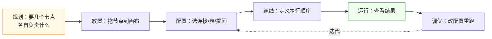
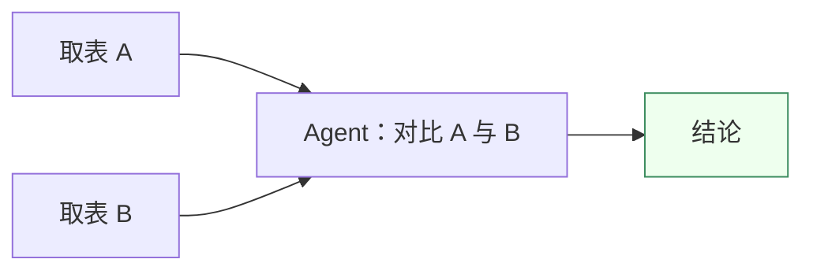
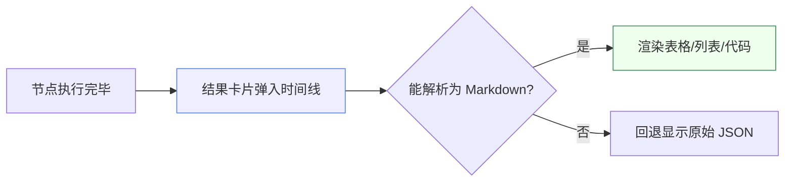
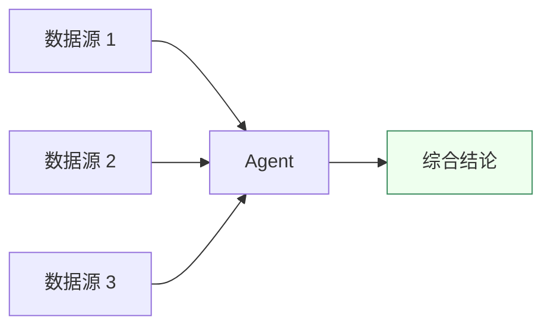

# 工作流设计

本章教你如何从零设计一个工作流。设计工作流就是回答三个问题：

1. **数据从哪来？** → 用数据节点
2. **要对数据做什么？** → 用 Agent 或处理节点
3. **结果给谁？** → 看执行时间线

## 设计流程总览

## 第一步：规划节点

动手前先在脑中画一张草图。以「对比两张表的增长趋势」为例：

需要 2 个数据节点 + 1 个 Agent，共 3 个节点。规划清楚了，放置时就不会乱。

## 第二步：放置并配置节点

从左侧节点面板把节点拖到画布，然后在右侧配置面板填写：

### 数据节点（DatabaseResource）

数据节点用**级联下拉**选择数据，不手填连接串：

选中表后，表的结构会自动注入节点上下文，下游 Agent 就能知道有哪些字段可用。

### Agent 节点

Agent 节点的核心配置是**一句自然语言提问**。写得越具体，结果越准。

| ✅ 好的提问 | ❌ 模糊的提问 |
| --- | --- |
| 统计这张表每天的行数，按日期升序 | 看看数据 |
| 找出金额最高的前 10 笔订单 | 分析一下 |
| 计算各品类的月度环比增长率 | 有什么趋势 |

:::tip 提问技巧
把「字段、时间范围、排序、聚合维度」都说清楚。Agent 会据此生成更精准的 SQL。
:::

## 第三步：连线

从上游节点的 **输出端口** 拖到下游节点的 **输入端口**。连线决定了两件事：

- **数据流** — 上游输出会作为下游输入。
- **执行顺序** — 引擎按拓扑序执行，被依赖的节点先跑。

:::warning 避免环路
工作流必须是**有向无环图**。如果连线形成了环，引擎会报错并拒绝执行。设计时让数据始终「从左向右」流动即可避免。
:::

## 第四步：运行

点击画布右上角 **运行**。引擎会：

1. 找出所有「入度为 0」的节点先执行；
2. 每个节点完成后，检查它的下游是否「所有上游都已完成」，是则执行；
3. 结果实时推送到执行时间线。

## 执行时间线

每个节点执行完毕，都会在时间线里生成一张结果卡片：

- 卡片按执行顺序依次出现，带有平滑的入场动画。
- 结果优先用 Markdown 渲染，保证可读。
- 每个节点的输入输出都可回看，方便排查问题。

## 第五步：调优

结果不理想时，**不用重画工作流**——改对应节点的配置再运行即可：

- 提问不准 → 修改 Agent 的自然语言描述。
- 取错表 → 重新选择 DatabaseResource 的表。
- 缺数据 → 新增一个数据节点连进来。

工作流本身就是「可保存、可复用、可迭代」的模板。

## 进阶：多输入汇聚

当你需要把多个数据源的结果喂给同一个 Agent 时，只要把多条连线都连到那个 Agent 的输入即可：

引擎会等三个数据源全部就绪后，再执行这个 Agent。这是工作流相比线性脚本最强大的能力。

## 下一步

- 让 Agent 帮你写 SQL → [Agent 执行](/docs/guide/agent-execution)
- 回看执行情况 → [控制台](/docs/guide/admin-dashboard)
