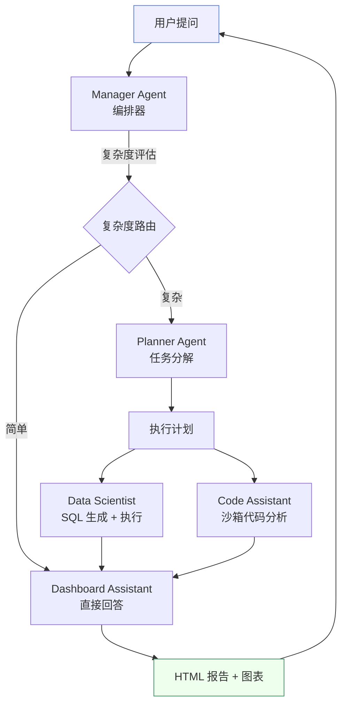

# 欢迎使用 Must Be The SQL

**Must Be The SQL** 是一个企业级 Multi-Agent NL2SQL 数据分析平台。
用户用自然语言提问，一组专业 AI Agent 协作完成数据库探索、SQL 生成与修复、沙箱代码分析和报告交付——每个 Agent 的思考过程实时可见。

> **新用户？** 从 [快速开始](/docs/getting-started/quickstart) 入手，十分钟跑通你的第一次多 Agent 对话。
> **想了解原理？** 阅读 [核心概念](/docs/constructure/concepts)，理解 Multi-Agent、思考模式与上下文压缩如何协作。

---

## 它能为你做什么

- **自然语言提问** — 用大白话描述数据需求，Manager Agent 自动编排专业 Agent 协作完成
- **实时思考过程** — 每个 Agent 的 LLM 推理链路通过 SSE 流式展示，决策逻辑透明可见
- **自主 SQL 生成与修复** — Data Scientist Agent 生成多候选 SQL、执行、自动修复
- **沙箱代码执行** — Python/Shell 脚本在 Docker 隔离沙箱中运行，含安全校验
- **交互式 HTML 报告** — Dashboard Assistant 将分析结果合成为带图表的 HTML 报告
- **渐进式上下文压缩** — 四层策略（L1–L4）在 token 预算内保持长对话连续性
- **多租户工作区** — 用户→工作区两级隔离，4 级角色权限
- **运维可观测** — 独立控制台提供 LLM 调用监控、Agent 指标与执行回看

## 一个典型对话长什么样

你只需提出问题，Manager Agent 决定调度哪些专业 Agent，每个 Agent 的思考过程和执行结果实时展示在时间线上。

## 文档导览

| 章节 | 适合谁 | 回答什么问题 |
| --- | --- | --- |
| [快速开始](/docs/getting-started/introduction) | 第一次接触的人 | 它是什么、装在哪、怎么跑起来 |
| [核心概念](/docs/constructure/concepts) | 想理解原理的人 | Multi-Agent、思考模式、上下文压缩、沙箱之间是什么关系 |
| [使用指南](/docs/guide/agent-execution) | 日常使用者 | 怎么与多 Agent 系统交互、怎么看思考过程和报告 |
| [API 说明](/docs/api/overview) | 需要对接的开发者 | 有哪些接口、怎么跳转 Swagger |
| [常见问题](/docs/faq/general) | 遇到问题的人 | 高频疑问与排错指引 |

## 下一步

**🚀 [快速开始 →](/docs/getting-started/quickstart)** — 十分钟完成安装并跑通第一次多 Agent 对话。

:::note 文档与接口文档的区别
本站是**产品使用手册**（怎么用），由 Docusaurus 构建。Java 后端的接口契约由独立的 Swagger（OpenAPI）提供，两者分开。需要时可在 [API 说明](/docs/api/overview) 中一键跳转。
:::
