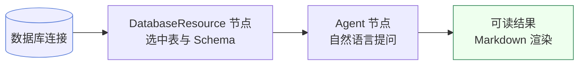

# 欢迎使用 Must Be The SQL

**Must Be The SQL** 是一个面向数据团队的可视化 SQL 工作流引擎。
在画布上连接数据库、编排 Agent、产出可读结论——无需编写代码，也无需记忆 SQL 语法。

> **新用户？** 从 [快速开始](/docs/getting-started/quickstart) 入手，十分钟跑通你的第一个工作流。
> **想了解原理？** 阅读 [核心概念](/docs/constructure/concepts)，理解节点、工作流与 Agent 如何协作。

---

## 它能为你做什么

- **可视化编排** — 用拖拽画布把「取数 → 分析 → 结论」串成可复用的工作流，告别一次性脚本。
- **自然语言提问** — 对着数据用大白话提问，由 Agent 自动生成并执行 SQL，结果以可读的方式呈现。
- **真实数据源感知** — 连接数据库后自动列出 Schema 与表，选中即可用，无需手填连接串。
- **执行可追溯** — 每一步执行都进入时间线，结果以 Markdown 渲染，过程可回看、可分享。
- **运维可观测** — 独立控制台提供工作流状态、Agent 步骤指标与 LLM 调用监控。

## 一个典型工作流长什么样

你把「数据从哪来」交给 DatabaseResource 节点，把「想要什么」交给 Agent 节点，剩下的交给引擎。

## 文档导览

| 章节 | 适合谁 | 回答什么问题 |
| --- | --- | --- |
| [快速开始](/docs/getting-started/introduction) | 第一次接触的人 | 它是什么、装在哪、怎么跑起来 |
| [核心概念](/docs/constructure/concepts) | 想理解原理的人 | 节点、工作流、Agent、连接之间是什么关系 |
| [使用指南](/docs/guide/workflow-design) | 日常使用者 | 怎么设计、执行、监控一个工作流 |
| [API 说明](/docs/api/overview) | 需要对接的开发者 | 有哪些接口、怎么跳转 Swagger |
| [常见问题](/docs/faq/general) | 遇到问题的人 | 高频疑问与排错指引 |

## 下一步

**🚀 [快速开始 →](/docs/getting-started/quickstart)** — 十分钟完成安装并跑通第一个工作流。

:::note 文档与接口文档的区别
本站是**产品使用手册**（怎么用），由 Docusaurus 构建。Java 后端的接口契约由独立的 Swagger（OpenAPI）提供，两者分开。需要时可在 [API 说明](/docs/api/overview) 中一键跳转。
:::
